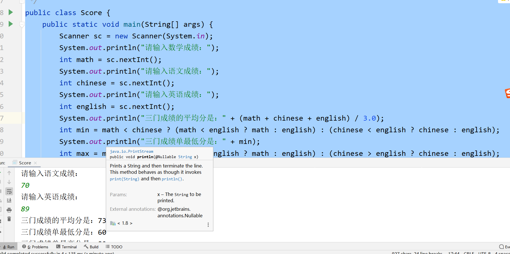
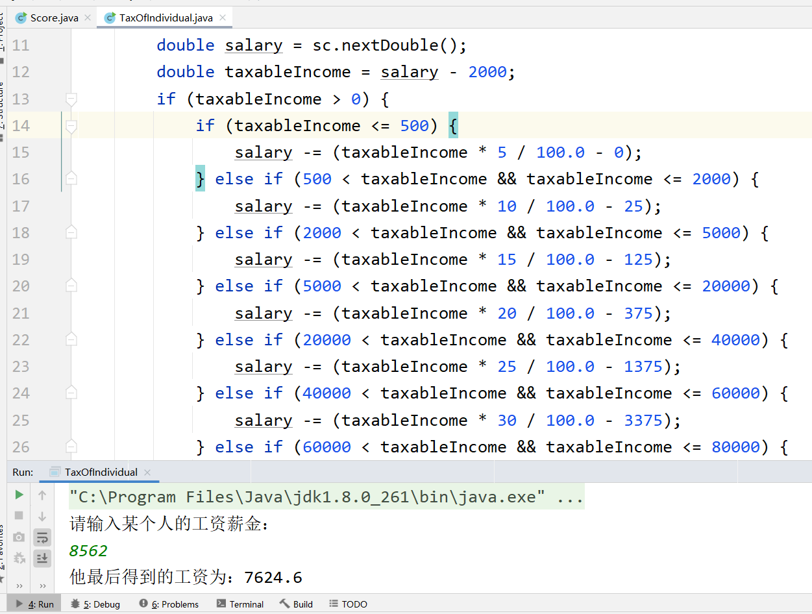

# 今日作业的目标

> 今日的作业以巩固基础为主，请大家注意命名规范，把代码写的干净漂亮

**完成作业后，需要将md文件转换成PDF格式，并命名为当天的课程名+下划线+自己的名字！压缩后提交！**

- 可以通过查看共享目录下，课程资料中**dayXx_Xxx**就是课程名
- 下划线不要弄错了，不能是空格或者横杠
- 下划线后跟自己的名字，不要在名字后面添一些乱七八糟的东西，如pdf后缀名
- 必须压缩后提交，压缩格式不限，rar、7z、zip等等都可以
- 以上格式满足后，就可以提交作业了

```
提交作业的网址（局域网内网网站）：
	http://192.168.2.100:8080/upload/java/..th
链接最后的“..th”表示班级的期数，比如你是Java28期学生，这里就填入28th

一般来说，打开这个网站对浏览器种类没有特别的要求，仅建议不要直接使用微信自带浏览器
需要注意的是，如果多次重复提交某一天的作业，必须保持名字不同
	建议在“课程名+下划线+自己的名字”的后面加上2，3...之类的数字以示区分
```


## 操作题

> 操作题，无需表现在作业答案中，自己琢磨和练习即可

- 熟悉IDEA的使用
  - 创建project
  - 创建module
  - 快捷键
  - 常用设置
- 熟悉Typora、学习学习markdown语言


## 非编程题

> 选择题或判断题，不仅需要答题，还需要说明原因（**重要**）

### 下面的逻辑表达式中合法的是	

```
答：C
```


```Java
A.(1+2) && (1*2)   B.(8-5) || (7*7)
C.(9>6) && (9<10)  D.(9%4) && (8*3)
```

#### 标识符的命名规范

问题：

1. 从语法上来说，标识符的命名中什么不能作为开头？		

   ```
   标识符的开头
     - 字母
     - 下划线（_）
     - 美元符号（$）
     - Unicode 字符集中符号大于0xC0的所有符号
   ```

2. 从语法上来说，可以用中文给标识符命名吗？                 

    

   ```
   可以，中文属于Unicode 字符集中符号大于0xC0的符号
   ```

   

3. 实际约定规范中，应该怎么写标识符命名规范？从包名，类名，变量名，方法名等角度具体说明

```
a.包的命名
             包的命名以反转公司的域名,全部小写为开头
               举例:
                  www.cskaoyan.com ---> com.cskaoyan
                   www.baidu.com ---> com.baidu
               而后根据不同的功能,不同的用途自行定义包名(但是仍然要求小写)
               注意事项:
                   a.写代码一定要有包,不建议直接在src目录下创建Java文件
                   b.包名全部小写
                   c.多级包名之间用"."分隔
 
b.类的命名 定义class时的命名规范: 遵循大驼峰式的命名规范
           比如Student,Dog,CatBody
           注意事项:
               1.尽量使用正确的英文单词,不要用中文,不要用拼音(除非有特殊情况)
               2.类在命名时尽量"见名知意"
 
c.变量的命名 给变量起名字:遵循小驼峰式的命名规范
           比如age,score,salary,myName,yourName
```


#### 基本数据类型的类型转换

问题：

1. 大的分类上来说，类型转换有几类？分别是什么？

   ```
   四类: 
   	 整型,浮点型(小数),布尔类型,字符型
   八种:
        整型: byte(1字节),short(2字节),int(4字节),long(8字节)
                 在Java中整型数据是以"有符号数"的形式存储的
        浮点型: float(4字节),double(8字节)
                在Java当中浮点数的存储遵循"IEEE754"标准
        字符类型: char(2个字节)
        布尔类型: boolean 用来表示真或者假
   ```

2. 请从以下两个角度说明类型转换：
   - 数据类型的取值范围		

     ```
     自动类型转换：把"小取值范围"的数据类型转换成"大取值范围"的数据类型,无需写额外代码
     强制类型转换：把"大取值范围"的数据类型转换成"小取值范围"的数据类型,需要写额外代码
     
     基本数据类型的数据类型转换前提:
            必须在byte、short、int、long、float、double这些数值类型和char类型之间进行
        boolean不参与基本数据类型的数据类型转换
        
     表达式的类型提升: 多种基本数据类型数据参与运算时，如果表达式当中存在多种数据类型，那么结果将会自动提升到表达式中最大取值范围的数据类型
     	例：
     	  1.byte,short,char三种数据类型参与运算,全部直接提升到int,而不是三种之一
            2.String字符串可以做加号的拼接操作,一旦表达式中有字符串参与拼接运算,不管它是在哪里做的拼接,结果一定是字符串类型
           3.char类型参与运算,是编码值参与运算
     ```

   - 是否需要写额外代码    

   - ```
     自动类型转换
     强制类型转换
     ```

3. 类型转换有无风险？       

```
把整型转换成浮点型时,会有精度问题，因为浮点数有有效位数限制
强制类型转换是"大到小",这是很危险的操作,很容易出现数据溢出,导致数据失真
从小到大也有风险，如：int-->float
```


#### 表达式的自动类型提升

1. 如果多种基本数据类型共同参与组成一个表达式，那么它的结果最终是什么数据类型？

   ```
   结果将会自动提升到表达式中最大取值范围的数据类型
   byte,short,char三种数据类型参与运算,全部直接提升到int,而不是三种之一
   ```

2. 如果表达式中有字符串String参与拼接运算，那么它的结果呢？         

   ```
   String字符串可以做加号的拼接操作,一旦表达式中有字符串参与拼接运算,不管它是在哪里做的拼接,结果一定是字符串类型
   ```

   


## 编程题

> 编程题，需要先编写代码，执行调试完毕后
>
> 将代码以代码块（CTRL+A贴入整个Java文件内容，而不是一个main方法）的格式贴入md文件
>
> 并附上执行结果图片

### 敲一遍老师上课的代码

> 根据老师在每一个Demo类注释的头部写的问题，逐一敲一遍老师的代码
>
> 尤其是那些不知道该怎么下手做作业的同学，一定要认真敲一遍老师代码


#### 基础语法练习s

> 代码直接写在main()方法中即可，注意命名规范

```
键盘输入某个学生的三门学科（数学，语文，英语）成绩，然后分别求出三科成绩的平均分，最低分，最高分，三科的总分
```

```java
package com.cskaoyan;

import java.util.Scanner;

/**
 * 键盘输入某个学生的三门学科（数学，语文，英语）成绩，然后分别求出三科成绩的平均分，最低分，最高分，三科的总分
 */
public class Score {
    public static void main(String[] args) {
        Scanner sc = new Scanner(System.in);
        System.out.println("请输入数学成绩：");
        int math = sc.nextInt();
        System.out.println("请输入语文成绩：");
        int chinese = sc.nextInt();
        System.out.println("请输入英语成绩：");
        int english = sc.nextInt();
        System.out.println("三门成绩的平均分是：" + (math + chinese + english) / 3.0);
        int min = math < chinese ? (math < english ? math : english) : (chinese < english ? chinese : english);
        System.out.println("三门成绩单最低分是：" + min);
        int max = math > chinese ? (math > english ? math : english) : (chinese > english ? chinese : english);
        System.out.println("三门成绩单最高分是：" + max);
        System.out.println("三门成绩的总分是：" + (chinese + math + english));
    }
}
```



#### if多分支练习

> 代码直接写在main()方法中即可，注意命名规范

```
键盘录入某个人的工资收入，求他应该缴纳的个人所得税以及最后得到的工资。

个人所得税计算方法计算方法 :
应纳税所得额 = 工资薪金所得-2000（即工资超过2000的部分才需要缴税）
应纳税额 = 应纳税所得额 * 税率 - 速算扣除数 （速算扣除额已经扣除了重复计算的部分）

注意理解题目，速算扣除额已经扣除了重复计算的部分，计算直接套用公式即可，不需要你去思考重复计算的部分

所缴税额分级符合下列表格：
级数          全月应纳税所得额                 税率（％）           速算扣除数

 1              不超过500元的                    5                   0

 2           超过500元但是不超过2000的             10                 25

 3          超过2000元但是不超过5000元的            15                125

 4          超过5000元但是不超过20000元的           20                 375

 5          超过20000元但是不超过40000元的          25                 1375

 6          超过40000元但是不超过60000元的          30                  3375

 7         超过60000元但是不超过80000元的           35                  6375

 8         超过80000元但是不超过100000元的          40                  10375

 9          超过100000元的                        45                   15375
```

```java
package com.cskaoyan;

import java.util.Scanner;

import static java.lang.Character.getType;

public class TaxOfIndividual {
    public static void main(String[] args) {
        System.out.println("请输入某个人的工资薪金：");
        Scanner sc = new Scanner(System.in);
        double salary = sc.nextDouble();
        double taxableIncome = salary - 2000;
        if (taxableIncome > 0) {
            if (taxableIncome <= 500) {
                salary -= (taxableIncome * 5 / 100.0 - 0);
            } else if (500 < taxableIncome && taxableIncome <= 2000) {
                salary -= (taxableIncome * 10 / 100.0 - 25);
            } else if (2000 < taxableIncome && taxableIncome <= 5000) {
                salary -= (taxableIncome * 15 / 100.0 - 125);
            } else if (5000 < taxableIncome && taxableIncome <= 20000) {
                salary -= (taxableIncome * 20 / 100.0 - 375);
            } else if (20000 < taxableIncome && taxableIncome <= 40000) {
                salary -= (taxableIncome * 25 / 100.0 - 1375);
            } else if (40000 < taxableIncome && taxableIncome <= 60000) {
                salary -= (taxableIncome * 30 / 100.0 - 3375);
            } else if (60000 < taxableIncome && taxableIncome <= 80000) {
                salary -= (taxableIncome * 35 / 100.0 - 6375);
            } else if (80000 < taxableIncome && taxableIncome <= 100000) {
                salary -= (taxableIncome * 40 / 100.0 - 10375);
            } else {
                salary -= (taxableIncome * 45 / 100.0 - 15375);
            }
        }
        System.out.println("他最后得到的工资为：" + salary);
    }
}
```



#### switch练习

> 合理使用case穿越

- 利用switch语句输出每个月份对应的季节
  - 12，1，2 — 冬季
  - 3，4，5 — 春季
  - 6，7，8 —夏季
  - 9，10，11 —秋季

```java
package com.cskaoyan;

/**
 * 利用switch语句输出每个月份对应的季节
 * <p>
 * - 12，1，2 — 冬季
 * - 3，4，5 — 春季
 * - 6，7，8 —夏季
 * - 9，10，11 —秋季
 */
public class Season {
    public static void main(String[] args) {
        for (int i = 1; i <= 12; i++) {
            switch (i) {
                case 12:
                case 1:
                case 2:
                    System.out.println(i + "是 冬季");
                    break;
                case 3:
                case 4:
                case 5:
                    System.out.println(i + "是 春季");
                    break;
                case 6:
                case 7:
                case 8:
                    System.out.println(i + "是 夏季");
                    break;
                case 9:
                case 10:
                case 11:
                    System.out.println(i + "是 秋季");
                    break;
            }
        }

    }
}
```


#### 完成小练习第一阶段

> 详情见具体文档描述


## 预习问题

> 预习的题目仅为预习提供思路，不用表现在作业中

- 预习方法和数组，考虑以下问题
  - 方法如何定义？为何定义方法？
  - 方法怎么构成重载？为啥需要重载？
  - 数组怎么定义？数组的作用是什么？


