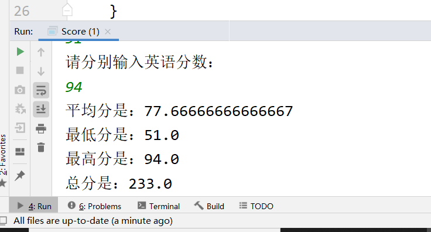
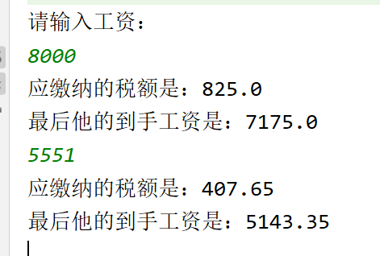
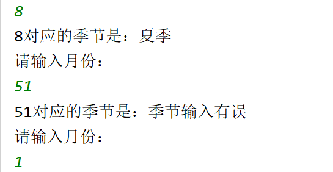
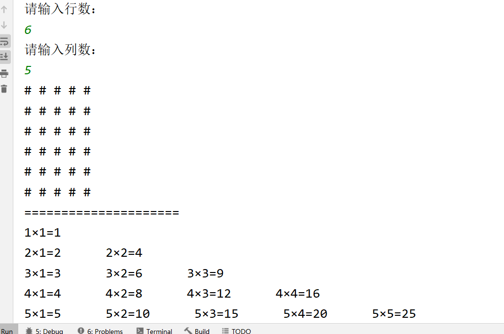

# 今日作业的目标

> 今日的作业还是以复习为主，方法的使用需要进行练习

**完成作业后，需要将md文件转换成PDF格式，并命名为当天的课程名+下划线+自己的名字！压缩后提交！**

- 可以通过查看共享目录下，课程资料中**dayXx_Xxx**就是课程名
- 下划线不要弄错了，不能是空格或者横杠
- 下划线后跟自己的名字，不要在名字后面添一些乱七八糟的东西，如pdf后缀名
- 必须压缩后提交，压缩格式不限，rar、7z等等都可以
- 以上格式满足后，就可以提交作业了

```
提交作业的网址（局域网内网网站）：
	http://192.168.2.100:8080/upload/java/..th
链接最后的“..th”表示班级的期数，比如你是Java28期学生，这里就填入28th

一般来说，打开这个网站对浏览器种类没有特别的要求，仅建议不要直接使用微信自带浏览器
需要注意的是，如果多次重复提交某一天的作业，必须保持名字不同
	建议在“课程名+下划线+自己的名字”的后面加上2，3...之类的数字以示区分
```


## 操作题

> 操作题，无需表现在作业答案中，自己琢磨和练习即可

熟悉方法的定义和调用，请注意标识符的命名规范


## 非编程题

### 简答题

问题：

1. if-else可以取代三目运算符，那么它们的区别是什么？

   答：三目运算符：

   语法：

   ```
   (条件表达式)?表达式1:表达式2; 
   ```

   适合用于相对简单的情况。在条件判断相对复杂的情况下，将导致代码的可读性变差。

   if-else：

   语法：

   ```java
   if (condition){
   	statement;
   }else if(condition2){
       statement2;
   }else{
       statement3;
   }
   ```

   哪个condition为true，就执行哪个statement；若condition都不满足，则执行else种的statement if语句特点：使用灵活，逻辑简单

    if的使用场景：

- 针对结果是布尔类型的判断 

* 多分支if结构，可以使用多个判断条件
*  if的判断条件可以，是一个连续的取值范围


2. 方法的返回值类型或者形参类型是long，意味着可以使用什么类型的返回值或实参？

   ​		byte	short	int	long  	char

3. for()循环中什么结构是不能省略的？

   ​		分号：”；“

4. return的作用是什么？

   ```java
       return可以在方法的任何位置使用,只要在方法中就可以使用,
       而循环写在方法中,循环中也可以使用return
       return的作用是立刻结束当前方法，并返回该方法需要返回的参数类型
   ```

5. Scanner键盘录入时，方法可以分为哪两类？它们的区别是什么？混用它们会有什么问题？

   ```
   Scanner中的方法分为两类:
          1.next/nextInt/nextDouble等,称之为next系列方法
              扫描是从第一个非空的字符开始的,并且只要碰到空格(空格/回车/制表等)就结束
          2.nextLine方法
             是完整的接收一行字符串,扫描从第一个字符就开始了(不论是什么字符),必须通过换行(回车)结束扫描
    
     如果在调用nextInt方法之后,直接调用nextLine会导致nextLine方法直接接收一个空字符,而不能正常运行
     原因在于回车被作为nextLine方法的结束控制,导致nextLine没有接收到任何字符,得到了一个空字符
   ```

   

## 编程题

> 编程题，需要先编写代码，执行调试完毕后
>
> 将代码以代码块（CTRL+A贴入整个Java文件内容，而不是一个main方法）的格式贴入md文件
>
> 并附上执行结果图片

### 敲一遍老师上课的代码

> 根据老师在每一个Demo类注释的头部写的问题，逐一敲一遍老师的代码
>
> 尤其是那些不知道该怎么下手做作业的同学，一定要认真敲一遍老师代码

- 今天尤其需要敲一下循环、循环控制关键字部分的代码
- 方法的使用自行练习一下


### 练习使用方法

> 把day01作业中的两道题，用方法进行改造。比如求平均分的方法，求税后收入的方法等

- 需要把原先在main方法中的代码提取出来作为一个方法，然后在main中调用测试它
- 需要注意方法的命名规范

```
键盘输入某个学生的三门学科（数学，语文，英语）成绩，然后分别求出三科成绩的平均分，最低分，最高分，三科的总分
```

```
import java.util.Scanner;

/**
 * 键盘输入某个学生的三门学科（数学，语文，英语）成绩，然后分别求出三科成绩的平均分，最低分，最高分，三科的总分
 */
public class Score {
    public static void main(String[] args) {
        Scanner sc = new Scanner(System.in);
        double math, chinese, english;
        System.out.println("请分别输入数学分数：");
        math = Double.parseDouble(sc.next());
        System.out.println("请分别输入语文分数：");
        chinese = Double.parseDouble(sc.next());
        System.out.println("请分别输入英语分数：");
        english = Double.parseDouble(sc.next());

        double aveScore, minScore, maxScore, totalScore;
        aveScore = getAveScore(math, chinese, english);
        minScore = getMinScore(math, chinese, english);
        maxScore = getMaxScore(math, chinese, english);
        totalScore = getTotalScore(math, chinese, english);
        System.out.println("平均分是：" + aveScore
                + "\n最低分是：" + minScore
                + "\n最高分是：" + maxScore
                + "\n总分是：" + totalScore);
    }

    private static double getTotalScore(double math, double chinese, double english) {
        return math + chinese + english;
    }

    private static double getMaxScore(double math, double chinese, double english) {
        return math > chinese ? (math > english ? math : english) : (chinese > english ? chinese : english);
    }

    private static double getMinScore(double math, double chinese, double english) {
        return math < chinese ? (math < english ? math : english) : (chinese < english ? chinese : english);
    }

    private static double getAveScore(double math, double chinese, double english) {
        return (math + chinese + english) / 3.0;
    }

}
```




```
键盘录入某个人的工资收入，求他应该缴纳的个人所得税以及最后得到的工资。
```

```java
import java.util.Scanner;

public class TaxOfIndividual {
    public static void main(String[] args) {
        Scanner sc = new Scanner(System.in);
        System.out.println("请输入工资：");
        double salary, tax;
        salary = Double.parseDouble(sc.next());
        while (salary > 0) {
            tax = getTax(salary);
            System.out.println("应缴纳的税额是：" + tax);
            System.out.println("最后他的到手工资是：" + (salary-tax));
            salary = Double.parseDouble(sc.next());
        }
    }

    private static double getTax(double salary) {
        double taxable = salary - 2000;
        double taxRate = 0;
        double dedution = 0;
        double tax;
        if (taxable > 0) {
            if (taxable <= 500) {
                taxRate = 0.05;
                dedution = 0;
            } else if (taxable > 500 && taxable <= 2000) {
                taxRate = 0.10;
                dedution = 25;
            } else if (taxable > 2000 && taxable <= 5000) {
                taxRate = 0.15;
                dedution = 125;
            } else if (taxable > 5000 && taxable <= 20000) {
                taxRate = 0.20;
                dedution = 375;
            } else if (taxable > 20000 && taxable <= 40000) {
                taxRate = 0.25;
                dedution = 1375;
            } else if (taxable > 40000 && taxable <= 60000) {
                taxRate = 0.30;
                dedution = 3375;
            } else if (taxable > 60000 && taxable <= 80000) {
                taxRate = 0.35;
                dedution = 6375;
            } else if (taxable > 80000 && taxable <= 100000) {
                taxRate = 0.40;
                dedution = 10375;
            } else if (taxable > 100000) {
                taxRate = 0.45;
                dedution = 15375;
            }
        }

        //应纳税额 = 应纳税所得额 * 税率 - 速算扣除数 （速算扣除额已经扣除了重复计算的部分）
        tax = taxable * taxRate - dedution;
        return tax;
    }
}
```




```
利用switch语句输出每个月份对应的季节
```

```
import java.util.Scanner;

/**
 * 利用switch语句输出每个月份对应的季节
 * <p>
 * - 12，1，2 — 冬季
 * - 3，4，5 — 春季
 * - 6，7，8 —夏季
 * - 9，10，11 —秋季
 */
public class Season {
    public static void main(String[] args) {
        Scanner sc = new Scanner(System.in);
        int month;
        while (true) {
            System.out.println("请输入月份：");
            month = Integer.parseInt(sc.next());
            System.out.println(month + "对应的季节是：" + getSeason(month));
        }
    }

    public static String getSeason(int month) {
        String season = "输入月份有误！";
        switch (month) {
            case 12:
            case 1:
            case 2:
                season = "冬季";
                break;
            case 3:
            case 4:
            case 5:
                season = "春季";
                break;
            case 6:
            case 7:
            case 8:
                season = "夏季";
                break;
            case 9:
            case 10:
            case 11:
                season = "秋季";
                break;
            default:
                season = "季节输入有误";
        }
        return season;
    }
}
```




### 练习使用方法

> 主要练习使用方法去复用代码，并且可以提升程序的扩展性。
>
> 定义以下两个类，并测试：

- 根据键盘录入打印n行m列井号，n和m是可变的

- 根据键盘录入打印nn乘法表，n是可变的

  ```
  import java.util.Scanner;
  
  public class PrintSharp {
      public static void main(String[] args) {
          Scanner sc = new Scanner(System.in);
          while (true) {
              System.out.println("请输入行数：");
              int row = Integer.parseInt(sc.next());
              System.out.println("请输入列数：");
              int line = Integer.parseInt(sc.next());
              printSharp(row, line);
              System.out.println("=====================");
              printForm(line);
              System.out.println();
          }
      }
  
      private static void printForm(int line) {
          for (int i = 1; i <= line; i++) {
              for (int j = 1; j <= i; j++) {
                  System.out.print(i + "×" + j + "=" + (i * j) + "      ");
              }
              System.out.println();
          }
      }
  
      private static void printSharp(int row, int line) {
          for (int i = 0; i < row; i++) {
              for (int j = 0; j < line; j++) {
                  System.out.print("# ");
              }
              System.out.println();
          }
      }
  }
  ```

  

### 完成小练习阶段一

> 详情见相关PDF文档


## 预习问题

> 预习的题目仅为预习提供思路，不用表现在作业中

- 预习方法的重载和数组