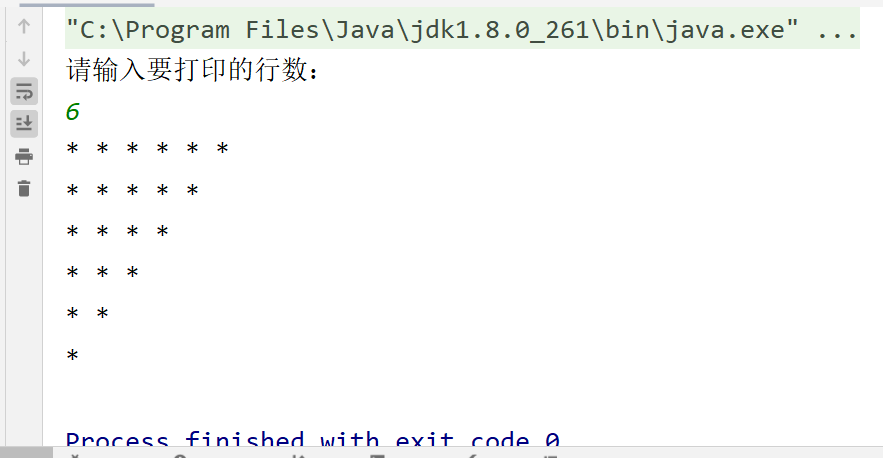

# 今日作业的目标

> 今日的作业需要练习方法和数组的使用，加深理解JVM的内存模型图

**完成作业后，需要将md文件转换成PDF格式，并命名为当天的课程名+下划线+自己的名字！压缩后提交！**

- 可以通过查看共享目录下，课程资料中**dayXx_Xxx**就是课程名
- 下划线不要弄错了，不能是空格或者横杠
- 下划线后跟自己的名字，不要在名字后面添一些乱七八糟的东西，如pdf后缀名
- 必须压缩后提交，压缩格式不限，rar、7z等等都可以
- 以上格式满足后，就可以提交作业了

```
提交作业的网址（局域网内网网站）：
	http://192.168.2.100:8080/upload/java/..th
链接最后的“..th”表示班级的期数，比如你是Java28期学生，这里就填入28th

一般来说，打开这个网站对浏览器种类没有特别的要求，仅建议不要直接使用微信自带浏览器
需要注意的是，如果多次重复提交某一天的作业，必须保持名字不同
	建议在“课程名+下划线+自己的名字”的后面加上2，3...之类的数字以示区分
```


## 操作题

> 操作题，无需表现在作业答案中，自己琢磨和练习即可

1. 练习使用Junit

   > 如果有导包、导入依赖等问题可以尝试百度解决。顺便试一试在Junit中使用Scanner~

2. 练习使用Debug模式，尝试Debug以下代码：

```java
public class Demo {
    public static void main(String[] args) {
        System.out.println("hello world");
        int a =  10;
        int b  = 20;
        int c ;
        c = a + b;
        Scanner sc = new Scanner(System.in);
        int num = sc.nextInt();
        if (num > 0) {
            System.out.println("你输入的数大于0");
        } else if (num == 0) {
            System.out.println("你输入的数等于0");
        } else {
            System.out.println("你输入的数小于0");
        }
        for (int i = 0; i < 5; i++) {
            for (int j = 0; j < 3; j++) {
                System.out.print("#");
            }
            System.out.println();
        }
        method();
    }
    public static void method() {
        System.out.println("test");
        System.out.println("test");
        System.out.println("test");
        System.out.println("test");
    }
}
```


## 非编程题

> 简答题直接给出答案即可~

### 简答题

问题：

1. 方法的实参和形参的区别是什么?

   ```
   一、函数中使用：
   形参出现在函数定义中，在整个函数体内都可以使用， 离开该函数则不能使用。实参出现在主函数中，进入被调函数后，实参变量也不能使用。
   
   二、调用
   形参变量只有在被调用时才分配内存单元，在调用结束时，即刻释放所分配的内存单元。因此，形参只在函数内部有效。函数调用结束返回主调用函数后则不能再使用该形参变量。
   实参可以是常量、变量、表达式、函数等，无论实参是何种数据类型，在进行函数调用时，它们都必须有确定的值，以便把这些值传送给形参。因此应预先用赋值，输入等办法使参数获得确定值。
   ```

   

2. 方法重载发生的条件是什么?形参的名字不同能否构成方法的重载?

   ```
   方法的重载:
        在Java的同一个类当中,允许出现方法名相同的多个方法的现象,称之为方法的重载
   方法的重载的条件: 在方法名相同的情况下,方法的签名必须不同(也就是说必须形参列表不同)
   
    	方法的调用必须能够让编译器明确找个某个方法,当方法名相同时,如果形参列表还相同的话,那其实就是一个方法.所以就无从找到对应的方法了，此时就无法构成方法的重载了
   ```

   

3. 方法可以没有返回值类型吗?

   ```
   返回值类型,指的是返回值的数据类型.它可以是基本数据类型,也可以是引用数据类型
   方法一定要有返回值类型
   方法可以没有返回值,但是方法允许没有返回值类型吗?
             方法一定要有返回值类型,如果没有返回值,用"void"填入返回值类型的位置
             void本身就是一个返回值类型,它表示方法没有返回值
   ```

   

4. 什么是全限定类名？它的作用是什么？

   ```
   把"包名+类名"的形式,称之为一个类的"全限定类名"
   它的作用是唯一的,准确的定位一个类
   ```

   

## 编程题

编程题的答题要求：

```
编程题，需要先编写代码，执行调试完毕后
将代码以代码块（CTRL+A贴入整个Java文件内容，而不是一个main方法）的格式贴入md文件
并附上执行结果图片
```

**如何在Typora中插入代码块？**

1. 可以直接从idea复制代码，然后粘贴进md文档，Typora会自动转换成代码块的格式
2. 可以在md文档空白处中右键，然后插入代码块，再把代码复制进来（熟练了可以使用快捷键）
3. 代码块右下角可以选择语言，建议直接填入Java（这样做会有颜色标记关键字）

**如何在Typora中插入图片？**

1. 可以使用微信/QQ/windows/Snipaste截图等截图工具截图到计算机粘贴板，然后直接粘贴到md文档中
2. 可以在md文档空白处中右键，然后插入图像，自己选择本地图片的路径（可以用，但不推荐）

---


### 敲一遍老师上课的代码

> 根据老师在每一个Demo类注释的头部写的问题，逐一敲一遍老师的代码
>
> 尤其是那些不知道该怎么下手做作业的同学，一定要认真敲一遍老师代码


### 基础语法练习

1. 使用for循环遍历100以内的奇数，并计算所有的奇数的和并输出，要求使用方法

   ```java
   /**
    * 使用for循环遍历100以内的奇数，并计算所有的奇数的和并输出
    */
   public class SumOfOdd {
       public static void main(String[] args) {
           System.out.println("100以内的奇数和是：" + getSum(100));
       }
   
       public static int getSum(int n) {
           int sum = 0;
           for (int i = 1; i <= n; i++) {
               if (i % 2 == 1) {
                   sum += i;
               }
           }
           return sum;
       }
   }
   ```

   

### 嵌套for循环

> 我们都知道嵌套for循环在打印图案时，外层for控制行数，内层for控制列数
>
> 那么如果要打印下列图案，该怎么办呢？

```
//倒三角形
******
*****
****	
***	
**	
*
```

---

```java
import java.util.Scanner;

public class PrintStar {
    public static void main(String[] args) {
        System.out.println("请输入要打印的行数：");
        Scanner sc = new Scanner(System.in);
        int line = Integer.parseInt(sc.next());
        printStar(line);
    }

    public static void printStar(int n) {
        for (int i = 6; i > 0; i--) {
            for (int j = 0; j < i; j++) {
                System.out.print("* ");
            }
            System.out.println();
        }
    }
}
```



> 今天的作业很少，请基础不好的同学及时复习前面的知识，尤其是循环部分，需要一定的代码量去熟悉使用
>
> 请大家有问题一定要及时提出来，及时沟通
>
> 对于基础较好的同学，请预习数组的使用


## 预习问题

> 预习的题目仅为预习提供思路，不用表现在作业中

- 预习一维数组、二维数组和递归，思考：
  - 怎么定义数组？数组的用途是什么？
  - 递归是什么？怎么使用递归？