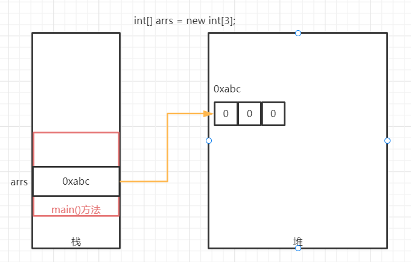
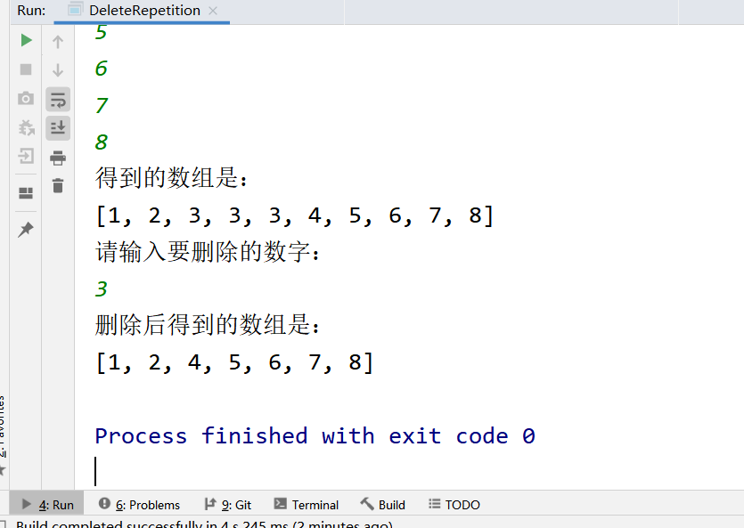

# 

> 今日的作业需要练习方法和数组的使用，加深理解JVM的内存模型图

**完成作业后，需要将md文件转换成PDF格式，并命名为当天的课程名+下划线+自己的名字！压缩后提交！**

- 可以通过查看共享目录下，课程资料中**dayXx_Xxx**就是课程名
- 下划线不要弄错了，不能是空格或者横杠
- 下划线后跟自己的名字，不要在名字后面添一些乱七八糟的东西，如pdf后缀名
- 必须压缩后提交，压缩格式不限，rar、7z等等都可以
- 以上格式满足后，就可以提交作业了

```
提交作业的网址（局域网内网网站）：
	http://192.168.2.100:8080/upload/java/..th
链接最后的“..th”表示班级的期数，比如你是Java28期学生，这里就填入28th

一般来说，打开这个网站对浏览器种类没有特别的要求，仅建议不要直接使用微信自带浏览器
需要注意的是，如果多次重复提交某一天的作业，必须保持名字不同
	建议在“课程名+下划线+自己的名字”的后面加上2，3...之类的数字以示区分
```


## 操作题

> 操作题，无需表现在作业答案中，自己琢磨和练习即可

- 手写一下数组的遍历，感受代码逐步完善的过程

> 以下画图题，需要提交相应的图片，并附上必要的文字说明

- 使用WPS、Windows自带画图或者网页搜索ProcessOn画图，完成以下JVM内存模型图的练习
  - 在main()中声明初始化一个局部变量
  
    
  
  - 数组动态初始化过程，数组静态初始化过程
  
    动态初始化：
  
    
  
    静态初始化：
  
    
  
  - 画出**交换数组的引用方法**的内存图（方法见老师代码）
  
    ```java
    //交换两个数组的引用
    public static void swapArray(int[] arr1, int[] arr2) {
        //交换需要临时工temp
        int[] temp;
        temp = arr1;
        arr1 = arr2;
        arr2 = temp;
        System.out.println("交换方法中arr1:" + Arrays.toString(arr1));
        System.out.println("交换方法中arr2:" + Arrays.toString(arr2));
    }
    ```
  
    

## 非编程题

> 简答题直接给出答案即可~

### 简答题

问题：

1. 数组的声明方式有几种？分别是什么？

   ```
   四种：
   int[] arr=new int[length];
   int[] arr=new int[]{参数1，参数2....};
   int[] arr={参数1，参数2....};
   int arr[]= {参数1，参数2....};
   ```

   

2. 数组的初始化方式有几种？分别是什么？

   ```
   两种，动态初始化和静态初始化。
   ```

   

3. 数组创建后，还能修改它的长度吗？可以修改元素的取值吗？

   ```
   不可以修改它的长度，可以修改元素的取值
   ```

   

4. 请指出各种数组对象中的元素的默认值

   ```
   对于基本数据类型int\long\byte\short来说，默认值都为0，
   float\double的默认值是0.0和0.0F
   char类型的默认值是\u0000
   boolean的默认值是false
   对于引用类型，默认值都是null
   ```

   

5. 数组操作中会碰到哪些异常？是什么原因导致的?

```
java.lang.ArrayIndexOutOfBoundsException：索引越界异常  非法访问不超过数组长度的下标
java.lang.NullPointerException：空指针异常	数组定义后被赋值为null
```


## 编程题

编程题的答题要求：

```
编程题，需要先编写代码，执行调试完毕后
将代码以代码块（CTRL+A贴入整个Java文件内容，而不是一个main方法）的格式贴入md文件
并附上执行结果图片
```

**如何在Typora中插入代码块？**

1. 可以直接从idea复制代码，然后粘贴进md文档，Typora会自动转换成代码块的格式
2. 可以在md文档空白处中右键，然后插入代码块，再把代码复制进来（熟练了可以使用快捷键）
3. 代码块右下角可以选择语言，建议直接填入Java（这样做会有颜色标记关键字）

**如何在Typora中插入图片？**

1. 可以使用微信/QQ/windows/Snipaste截图等截图工具截图到计算机粘贴板，然后直接粘贴到md文档中
2. 可以在md文档空白处中右键，然后插入图像，自己选择本地图片的路径（可以用，但不推荐）

---


### 敲一遍老师上课的代码

> 根据老师在每一个Demo类注释的头部写的问题，逐一敲一遍老师的代码
>
> 尤其是那些不知道该怎么下手做作业的同学，一定要认真敲一遍老师代码

- 数组的相关操作代码如果不熟练，可以先敲老师代码，再做题
- 否则语法、思维都不熟悉的话，作业题很难做出来


### 练习数组的使用

> 请合理使用方法，不要胡子眉毛一把抓把代码全部写在main方法里

1. 声明一个double数组，键盘录入10位同学的成绩并存入数组，求10位同学成绩的平均值

   ```java
   import java.util.Scanner;
   
   public class StuScore {
       public static void main(String[] args) {
           Scanner sc = new Scanner(System.in);
           System.out.println("请输入10位同学的成绩：");
           double[] scores = new double[10];
           for (int i = 0; i < scores.length; i++) {
               scores[i] = Double.parseDouble(sc.next());
           }
           System.out.println("10位同学的平均成绩是：" + getAveScore(scores));
   
       }
   
       public static double getAveScore(double[] scores) {
           double sum = 0;
           for (double score : scores) {
               sum += score;
           }
           return sum / scores.length;
       }
   }
   ```

   

2. 声明一个String数组，输出该数组的长度，并用多种方式遍历数组元素（常见的方式遍历即可）

   ```java
   import java.util.Arrays;
   
   public class ForString {
       public static void main(String[] args) {
           String[] strs = new String[]{"ab", "cd", "ef", "jk", "lm"};
   
           System.out.println(Arrays.toString(strs));
           System.out.println("===========================");
           printString1(strs);
           System.out.println("===========================");
           printString2(strs);
   
       }
   
       public static void printString1(String[] strs) {
           System.out.print("[");
           for (int i = 0; i < strs.length; i++) {
               System.out.print(strs[i] + ", ");
           }
           System.out.print("\b\b]");
           System.out.println();
       }
   
       public static void printString2(String[] strs) {
           System.out.print("[");
           for (String str : strs) {
               System.out.print(str + ", ");
           }
           System.out.print("\b\b]");
           System.out.println();
       }
   }
   ```

   

### 练习数组的使用

> 请合理使用方法，不要胡子眉毛一把抓把代码全部写在main方法里

```
现在你去参加快乐男声比赛，有10个评委打分，规则是去掉最高分和最低分，求平均分是最终成绩。请编码计算出你的最终成绩~
```

要求至少提供三个方法：

1. 求最大值
2. 求最小值
3. 求平均分

注意：最高分和最低分可能有多个，但只需要去掉其中一个即可（也就是说平均成绩要除以8）

```java
import java.util.Scanner;

public class JudgesScore {
    public static double getSumScore(double[] scores) {
        double sum = 0;
        for (double score : scores) {
            sum += score;
        }
        return sum;
    }

    public static double getMaxScore(double[] scores) {
        double maxScore = scores[0];
        for (int i = 1; i < scores.length; i++) {
            if (scores[i] > maxScore) {
                maxScore = scores[i];
            }
        }
        return maxScore;
    }

    public static double getMinScore(double[] scores) {
        double minScore = scores[0];
        for (int i = 1; i < scores.length; i++) {
            if (scores[i] < minScore) {
                minScore = scores[i];
            }
        }
        return minScore;
    }

    public static void main(String[] args) {
        Scanner sc = new Scanner(System.in);
        System.out.println("请10位评委打分：：");
        double[] scores = new double[10];
        for (int i = 0; i < scores.length; i++) {
            System.out.println("请第" + (i + 1) + "位评委打分");
            scores[i] = Double.parseDouble(sc.next());
        }
        System.out.println("===============================");
        System.out.println("去掉一个最高分：" + getMinScore(scores));
        System.out.println("===============================");
        System.out.println("去掉一个最低分：" + getMaxScore(scores));
        System.out.println("===============================");
        System.out.println("最终的平均分是："
                + (getSumScore(scores) - getMaxScore(scores) - getMinScore(scores)) / (scores.length - 2));
    }
}
```


### 数组综合练习

```
把一个数组中的某个（相同）元素全部去掉，并统计该元素有几个
```

注：这里说的去掉不是指用0/null等默认值替代原先的元素，而是指真正的删除掉

**思考：同一个数组能不能实现这个功能？应该怎么完成呢？**

```java
import com.sun.org.apache.xerces.internal.impl.xs.SchemaNamespaceSupport;

import java.util.Arrays;
import java.util.Scanner;

public class DeleteRepetition {
    public static void main(String[] args) {
        System.out.println("请输入10个数字：");
        Scanner sc = new Scanner(System.in);
        int[] arrs = new int[10];
        for (int i = 0; i < arrs.length; i++) {
            arrs[i] = Integer.parseInt(sc.next());
        }
        System.out.println("得到的数组是：");
        System.out.println(Arrays.toString(arrs));

        System.out.println("请输入要删除的数字：");
        int target = Integer.parseInt(sc.next());
        System.out.println("删除后得到的数组是：");
        System.out.println(Arrays.toString(deleteDuplicate(arrs, target)));
    }

    public static int[] deleteDuplicate(int[] arrs, int target) {
        int sum = 0;
        for (int arr : arrs) {
            if (arr == target) {
                sum++;
            }
        }
        int[] arrs1 = new int[arrs.length - sum];
        for (int i = 0, j = 0; i < arrs.length; i++) {
            if (arrs[i] != target) {
                arrs1[j] = arrs[i];
                j++;
            }
        }
        return arrs1;
    }
}
```



### 值传递相关练习

> Java有且仅有值传递，Java中的方法不能直接改变实参本身

```Java
    public static void main(String[] args) {
        int a = 10;
        int b = 20;
        method(a, b);
        System.out.println("a = " + a);
        System.out.println("b = " + b);
    }

    public static void method(int a, int b) {
        a *= 2;
        b *= 2;
    }
```

问题：

- 对于以上Java代码，可以把a，b的取值变为2倍吗？如果不能，为什么？

  ```
  1.不能变为两倍，在调用的方法的栈帧中初始化一个实参的副本，对这个副本进行操作，原先main方法栈帧的变量的值不会发生变化，并且在这个方法执行完数值乘以2后，随着方法出栈，这个实参的副本也被销毁了
  2.不能，对于基本数据类型局部变量而言,它的内存空间和取值都直接放在方法的栈帧中
  ```

  

现在请你完成以下需求：

- 使用方法，将两个int类型元素（变量）变为它的2倍，并且输出它们？
  - **思考这两个变量能是基本数据类型吗？**

```
public class DoubleInt {
    public static void main(String[] args) {
        Integer value1 = 1;
        Integer value2 = 2;
        System.out.println("value1 = " + value1 + ", value2 = " + value2);

        System.out.println("=======================================");
        getDoubleInt(value1, value2);
//        System.out.println("value1 = " + value1 + ", value2 = " + value2);
    }

    public static void getDoubleInt(Integer value1, Integer value2) {
        value1 = value1 * 2;
        value2 = value2 * 2;
        System.out.println("value1 = " + value1 + ", value2 = " + value2);
    }
}
```


## 预习问题

> 预习的题目仅为预习提供思路，不用表现在作业中

- 预习二维数组和递归，思考
  - 怎么定义二维数组？二维数组的用途是什么？
  - 递归是什么？怎么使用递归？

