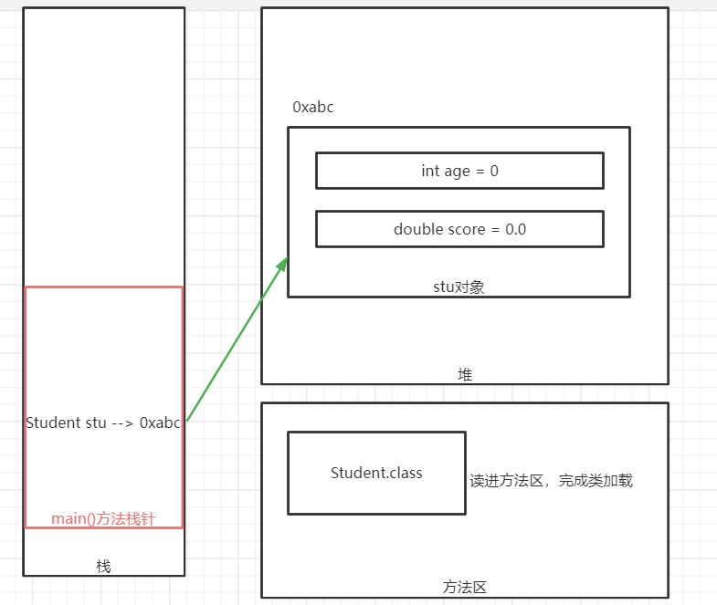
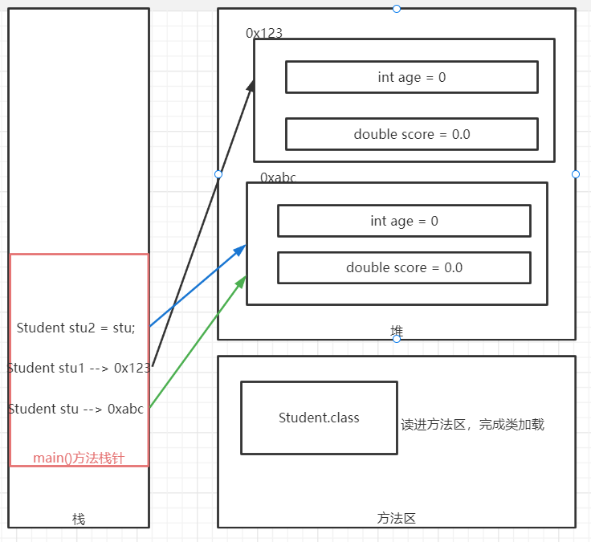
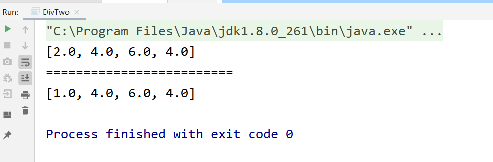
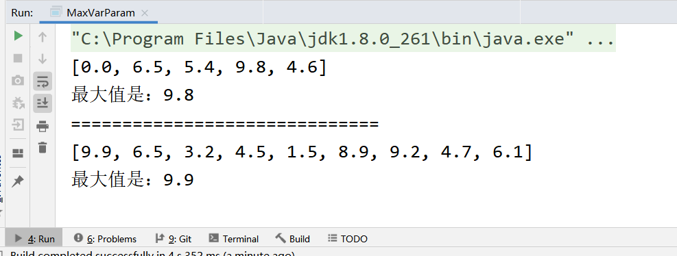
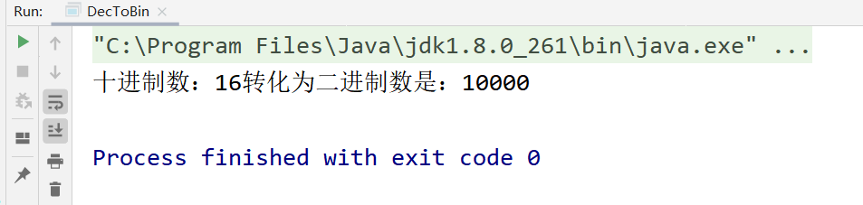
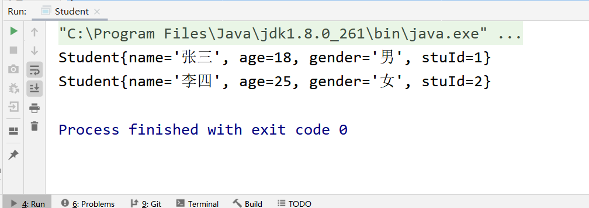
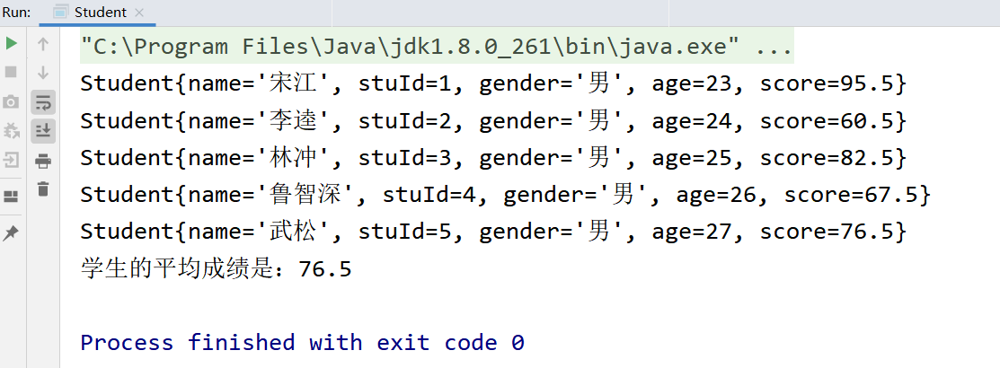

# 今日作业的目标

> 今日的作业需要练习递归的使用，对象与类基本语法，加深理解JVM的内存模型图

**完成作业后，需要将md文件转换成PDF格式，并命名为当天的课程名+下划线+自己的名字！压缩后提交！**

- 可以通过查看共享目录下，课程资料中**dayXx_Xxx**就是课程名
- 下划线不要弄错了，不能是空格或者横杠
- 下划线后跟自己的名字，不要在名字后面添一些乱七八糟的东西，如pdf后缀名
- 必须压缩后提交，压缩格式不限，rar、7z等等都可以
- 以上格式满足后，就可以提交作业了

```
提交作业的网址（局域网内网网站）：
	http://192.168.2.100:8080/upload/java/..th
链接最后的“..th”表示班级的期数，比如你是Java28期学生，这里就填入28th

一般来说，打开这个网站对浏览器种类没有特别的要求，仅建议不要直接使用微信自带浏览器
需要注意的是，如果多次重复提交某一天的作业，必须保持名字不同
	建议在“课程名+下划线+自己的名字”的后面加上2，3...之类的数字以示区分
```


## 操作题

> 操作题，无需表现在作业答案中，自己琢磨和练习即可

### 画图题

> 以下画图题，需要提交相应的图片，并附上必要的文字说明

- 使用WPS、Windows自带画图或者网页搜索ProcessOn画图，完成以下JVM内存模型图的练习
  - 创建一个Student对象，成员变量有int age，double score，画图描述该过程
  
    
  
  - 先创建两个Student对象，再声明第三个Student引用指向其中某个对象，画图描述该过程



## 非编程题

> 简答题直接给出答案即可~

### 简答题

问题：

---

1. 什么是值传递？什么是引用传递？

   ```
   * 两种传值的方式:
    * 1.值传递,指的是方法得到的是实参的拷贝,而不是实参本身(地址),那么:
    *      实参经过方法的修改后,方法执行完毕,并不会对原先的实参造成影响
    *
    * 2.引用传递,指的是方法得到的是实参本身(地址),而不是拷贝,那么:
    *      实参经过方法的修改后,方法执行完毕,会对原先的实参造成影响
   ```

   

2. Java当中方法的传值方式是什么？

   ```
   值传递
   ```

   

3. Java中的方法可以对实参做出什么改变？
   - 基本数据类型
   
  ```
     改变基本类型实参拷贝的值，原来的实参不会改变，不受影响
     ```
   
   - 引用数据类型
   
     ```
     借助拷贝的引用改变该引用指向的对象的属性，原本的引用仍然指向原来的对象，但是，指向的对象中的属性会发生改变
     ```
   
     
   
4. 可变参数的本质是什么？

   ```
   通过反编译可知，可变参数的本质就是数组。
   ```

   


## 编程题

编程题的答题要求：

```
编程题，需要先编写代码，执行调试完毕后
将代码以代码块（CTRL+A贴入整个Java文件内容，而不是一个main方法）的格式贴入md文件
并附上执行结果图片
```

**如何在Typora中插入代码块？**

1. 可以直接从idea复制代码，然后粘贴进md文档，Typora会自动转换成代码块的格式
2. 可以在md文档空白处中右键，然后插入代码块，再把代码复制进来（熟练了可以使用快捷键）
3. 代码块右下角可以选择语言，建议直接填入Java（这样做会有颜色标记关键字）

**如何在Typora中插入图片？**

1. 可以使用微信/QQ/windows/Snipaste截图等截图工具截图到计算机粘贴板，然后直接粘贴到md文档中
2. 可以在md文档空白处中右键，然后插入图像，自己选择本地图片的路径（可以用，但不推荐）

---


### 敲一遍老师上课的代码

> 根据老师在每一个Demo类注释的头部写的问题，逐一敲一遍老师的代码
>
> 尤其是那些不知道该怎么下手做作业的同学，一定要认真敲一遍老师代码

- 今天尤其需要敲一下循环、循环控制关键字部分的代码
- 方法的使用，方法的重载也需要自己敲一下


### 数组小练习

> 使用数组时，尤其要注意元素取值的变化

```
定义一个double类型的数组，让数组中每个元素（包括首位元素）都除以首位元素，得到的结果过作为该位置上的新元素。请在原先数组数组上操作，并输出新数组~
例如数组[2,4,6,4]经过运算得到新数组[1,2,3,2]
```

```java
import java.util.Arrays;

public class DivTwo {
    public static void main(String[] args) {
        double[] arrs = new double[]{2, 4, 6, 4};
        System.out.println(Arrays.toString(arrs));
        System.out.println("=========================");
        getHalfValue(arrs);
        System.out.println(Arrays.toString(arrs));
    }

    public static double[] getHalfValue(double[] arrs) {
        for (int i = 0; i < arrs.length; i++) {
            arrs[i] = arrs[i] / arrs[0];
        }
        return arrs;
    }
}
```



### 可变参数练习

> 可变参数的本质是数组

```
求不限定个数参数的最大值
```

```java
import java.util.Arrays;

public class MaxVarParam {
    public static void main(String[] args) {
        double[] arrs = {0.0, 6.5, 5.4, 9.8, 4.6};
        System.out.println(Arrays.toString(arrs));
        System.out.println("最大值是："+ getMaxValue(arrs));
        System.out.println("==============================");
        double[] arrs1 = {9.9,6.5,3.2,4.5,1.5,8.9,9.2,4.7,6.1};
        System.out.println(Arrays.toString(arrs1));
        System.out.println("最大值是："+ getMaxValue(arrs1));
    }

    public static double getMaxValue(double... arrs) {
        double max = Double.NEGATIVE_INFINITY;  //无穷小
        for (double arr : arrs) {
            if (arr > max) {
                max = arr;
            }
        }
        return max;
    }
}
```



### 练习使用递归

> 递归并不是必须要求掌握的编程技巧，练习思维即可（如果想不明白就百度吧~）

```
使用递归，把十进制正整数（N>=0）转换成二进制数
```

```java
public class DecToBin {
    public static void main(String[] args) {
        int num = 16;
        System.out.println("十进制数：" + num
                + "转化为二进制数是：" + DecimalToBinaryByRecursion(num));
    }

    //除二取余法
    public static String DecimalToBinaryByRecursion(int num) {
        int quotient = num / 2;             //除以2
        int remainder = num % 2;            //余数
        StringBuilder result = new StringBuilder("");
        if (quotient == 0) {
            return result.append(remainder).toString();
        }
        return DecimalToBinaryByRecursion(quotient) + remainder;    //每轮余数放到后面输出
    }
}
```



### 类与对象练习

> 定义类，然后创建对象，注意this的使用

```
定义一个Student类：
	要求包含4个成员变量 String name, int age, String gender, int stuId
	定义5个构造方法
      分别为：
      1，无参构造
     	2，初始化name成员变量值的单参构造方法
     	3，初始化name和stuId两个成员变量值的双参构造方法
     	4，初始化name，age，gender三个成员变量值的三参构造方法
     	5，初始化name，age，gender，stuId这4个成员变量值的4参构造方法
     思考：再上面5个构造方法的基础上，再定义一个构造方法单独给gender赋值，能够做到吗？为什么？
     最后再定义一个成员方法print()，打印这个学生类对象信息

定义完这个类后，创建两个Student对象分别为stu1和stu2
	要求stu1对象的四个成员变量name, age, gender, stuId的值分别为“张三”,18,"男", 1
    要求stu2对象的四个成员变量name, age, gender, stuId的值分别为“李四”,25,"女", 2
    两个对象分别调用print()方法
    两次调用方法输出的结果相同吗？
    为什么？
```

```java
public class Student {
    String name;
    int age;
    String gender;
    int stuId;

    //1，无参构造
    public Student() {
    }

    //* 2，初始化name成员变量值的单参构造方法
    public Student(String name) {
        this.name = name;
    }

    // * 3，初始化name和stuId两个成员变量值的双参构造方法
    public Student(String name, int stuId) {
        this.name = name;
        this.stuId = stuId;
    }

    //* 4，初始化name，age，gender三个成员变量值的三参构造方法
    public Student(String name, int age, String gender) {
        this.name = name;
        this.age = age;
        this.gender = gender;
    }

    //* 5，初始化name，age，gender，stuId这4个成员变量值的4参构造方法
    public Student(String name, int age, String gender, int stuId) {
        this.name = name;
        this.age = age;
        this.gender = gender;
        this.stuId = stuId;
    }

    //    定义一个成员方法print()，打印这个学生类对象信息
    public void print() {
        System.out.println("Student{" +
                "name='" + name + '\'' +
                ", age=" + age +
                ", gender='" + gender + '\'' +
                ", stuId=" + stuId +
                '}');
    }


//    再上面5个构造方法的基础上，不可以再定义一个构造方法单独给gender赋值
//    ，因为会和初始化name成员变量值的单参构造方法构成歧义
   /* public Student(String gender) {  //'Student(String)' is already defined in 'Student'
        this.gender = gender;
    }*/


    //    定义完这个类后，创建两个Student对象分别为stu1和stu2
// * 要求stu1对象的四个成员变量name, age, gender, stuId的值分别为“张三”,18,"男", 1
//            * 要求stu2对象的四个成员变量name, age, gender, stuId的值分别为“李四”,25,"女", 2
//            * 两个对象分别调用print()方法
    public static void main(String[] args) {
        //    定义完这个类后，创建两个Student对象分别为stu1和stu2
        Student stu1 = new Student("张三", 18, "男", 1);
        Student stu2 = new Student("李四", 25, "女", 2);
//        两个对象分别调用print()方法
        stu1.print();
        stu2.print();

        // * 两次调用方法输出的结果相同吗？
//        答：不相同，因为在一个Java类的任何(不加static)成员方法中,它的形参列表中都隐含了一个传参this，
//        而两次调用传入的this都是当前对象，分别是stu1、stu2，因此打印出的信息是分别stu1的、stu2的
    }
}
```



### 类与对象练习

> 定义类，然后创建对象，注意this的使用，合理使用方法

```
将上一题的Student类，复制一份，增添一个属性：double score用来表示该学生的Java成绩
然后：
   （1）修改print()方法，输出学生对象的name，stuId，gender，age，score的值(即输出学生信息)
   （2）增加一个构造方法，能够给学生对象全体成员变量赋值，要求使用this简化代码
   （2）创建五个该类的对象存入数组，先遍历输出每个学生的信息，再计算他们的平均Java成绩（尽量提取方法）
        提示：数组既可以存储基本数据类型的值，也可以存储引用数据类型的值
```

```java
package com;

public class Student {
    String name;
    int age;
    String gender;
    int stuId;
    double score;

    //1，无参构造
    public Student() {
    }

    //* 2，初始化name成员变量值的单参构造方法
    public Student(String name) {
        this.name = name;
    }

    // * 3，初始化name和stuId两个成员变量值的双参构造方法
    public Student(String name, int stuId) {
        this.name = name;
        this.stuId = stuId;
    }

    //* 4，初始化name，age，gender三个成员变量值的三参构造方法
    public Student(String name, int age, String gender) {
        this.name = name;
        this.age = age;
        this.gender = gender;
    }

    //* 5，初始化name，age，gender，stuId这4个成员变量值的4参构造方法
    public Student(String name, int age, String gender, int stuId) {
        this.name = name;
        this.age = age;
        this.gender = gender;
        this.stuId = stuId;
    }

    //    增加一个构造方法，能够给学生对象全体成员变量赋值，要求使用this简化代码
    public Student(String name, int age, String gender, int stuId, double score) {
        this.name = name;
        this.age = age;
        this.gender = gender;
        this.stuId = stuId;
        this.score = score;
    }

    //    修改print()方法，打印这个学生类对象信息
    public void print() {
        System.out.println("Student{" +
                "name='" + name + '\'' +
                ", stuId=" + stuId +
                ", gender='" + gender + '\'' +
                ", age=" + age +
                ", score=" + score +
                '}');
    }


    public static void main(String[] args) {
//        创建五个该类的对象存入数组，先遍历输出每个学生的信息，再计算他们的平均Java成绩（尽量提取方法）
        Student[] students = new Student[5];
        students[0] = new Student("宋江", 23, "男", 1, 95.5);
        students[1] = new Student("李逵", 24, "男", 2, 60.5);
        students[2] = new Student("林冲", 25, "男", 3, 82.5);
        students[3] = new Student("鲁智深", 26, "男", 4, 67.5);
        students[4] = new Student("武松", 27, "男", 5, 76.5);
        System.out.println("学生的平均成绩是：" + getAveScore(students));

    }

    public static double getAveScore(Student[] students) {
        double score = 0;
        for (Student student : students) {
            student.print();
            score += student.score;
        }
        return score / students.length;
    }
}
```



## 预习问题

> 预习的题目仅为预习提供思路，不用表现在作业中

- 预习和总结面向对象语法和概念