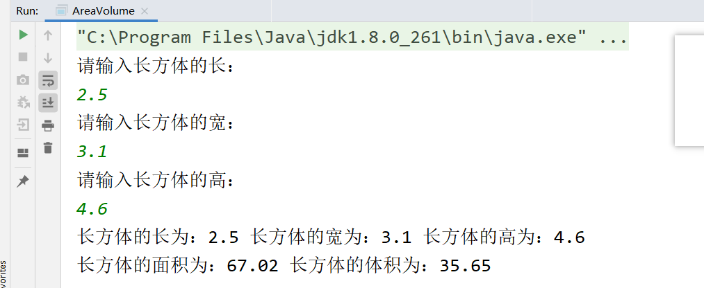
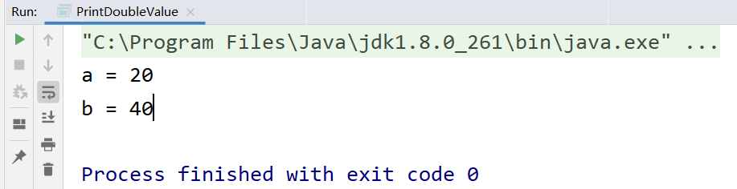
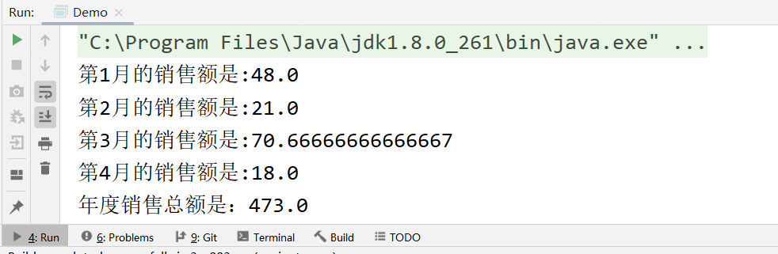
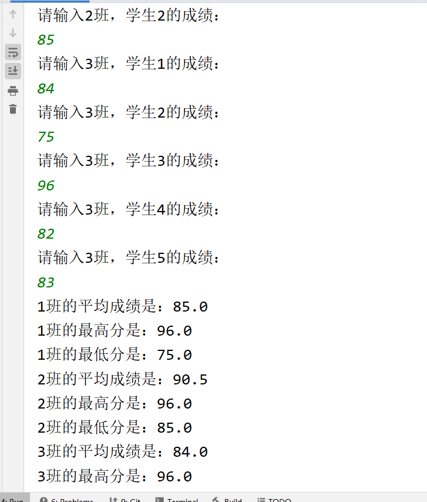

# 今日作业的目标

> 今日的作业需要练习方法和数组的使用，加深理解JVM的内存模型图

**完成作业后，需要将md文件转换成PDF格式，并命名为当天的课程名+下划线+自己的名字！压缩后提交！**

- 可以通过查看共享目录下，课程资料中**dayXx_Xxx**就是课程名
- 下划线不要弄错了，不能是空格或者横杠
- 下划线后跟自己的名字，不要在名字后面添一些乱七八糟的东西，如pdf后缀名
- 必须压缩后提交，压缩格式不限，rar、7z等等都可以
- 以上格式满足后，就可以提交作业了

```
提交作业的网址（局域网内网网站）：
	http://192.168.2.100:8080/upload/java/..th
链接最后的“..th”表示班级的期数，比如你是Java28期学生，这里就填入28th

一般来说，打开这个网站对浏览器种类没有特别的要求，仅建议不要直接使用微信自带浏览器
需要注意的是，如果多次重复提交某一天的作业，必须保持名字不同
	建议在“课程名+下划线+自己的名字”的后面加上2，3...之类的数字以示区分
```


## 操作题

> 操作题，无需表现在作业答案中，自己琢磨和练习即可

Debug模式练习：

创建Student对象，通过Debug模式查看成员变量赋值顺序

```java 
class Student {
    int age = 10;
    String name = "张三";
    double a = 100;

    public Student(int age) {
        System.out.println("Student age");
        this.age = age;
    }

    public Student() {
    }

    public Student(int age, String name) {
        this(age);
        System.out.println("Student age,name");
        this.name = name;
    }
}
```


## 非编程题

> 简答题直接给出答案即可~

### 简答题

问题：

1. 关于成员变量的赋值，有几种赋值的方式。谈谈赋值的先后顺序

   ```java
   //在成员变量有显式赋值,默认初始化,构造器赋值三种赋值方式的时候,它们的执行顺序是:
   //   1.默认初始化
   //   2.显式赋值
   //   3.构造器
   ```

   

2. 包装类有哪些？

   ```java
   //* byte ---> Byte
    //* short ---> Short
   // * int ---> Integer
   // * long ---> Long
   // *
   // * float ---> Float
    //* double ---> Double
    //*
    //* char ---> Character
    //*
    //* boolean ---> Boolean
    //* ----------
    //* 除此之外,还有一个特殊的包装类型
    //* void ----> Void
   ```

   


## 编程题

编程题的答题要求：

```
编程题，需要先编写代码，执行调试完毕后
将代码以代码块（CTRL+A贴入整个Java文件内容，而不是一个main方法）的格式贴入md文件
并附上执行结果图片
```

**如何在Typora中插入代码块？**

1. 可以直接从idea复制代码，然后粘贴进md文档，Typora会自动转换成代码块的格式
2. 可以在md文档空白处中右键，然后插入代码块，再把代码复制进来（熟练了可以使用快捷键）
3. 代码块右下角可以选择语言，建议直接填入Java（这样做会有颜色标记关键字）

**如何在Typora中插入图片？**

1. 可以使用微信/QQ/windows/Snipaste截图等截图工具截图到计算机粘贴板，然后直接粘贴到md文档中
2. 可以在md文档空白处中右键，然后插入图像，自己选择本地图片的路径（可以用，但不推荐）

---


### 敲一遍老师上课的代码

> 根据老师在每一个Demo类注释的头部写的问题，逐一敲一遍老师的代码
>
> 尤其是那些不知道该怎么下手做作业的同学，一定要认真敲一遍老师代码

- 先敲代码学会语法，再做题


### 类与对象练习

```
定义一个长方体类，给出它的属性，并定义两个成员方法，分别计算并输出长方体的体积和表面积
```

```java
package com;

import java.util.Scanner;

public class AreaVolume {
    public static void main(String[] args) {
        Scanner sc = new Scanner(System.in);
        System.out.println("请输入长方体的长：");
        double length = Double.parseDouble(sc.next());

        System.out.println("请输入长方体的宽：");
        double wide = Double.parseDouble(sc.next());

        System.out.println("请输入长方体的高：");
        double height = Double.parseDouble(sc.next());
        
        Cuboid cuboid = new Cuboid(length, wide, height);
        System.out.println("长方体的长为：" + cuboid.length
                + " 长方体的宽为：" + cuboid.wide
                + " 长方体的高为：" + cuboid.height);
        System.out.println("长方体的面积为：" + cuboid.getArea()
                + " 长方体的体积为：" + cuboid.getVolume());
    }
}

class Cuboid {
    double length;
    double wide;
    double height;

    public Cuboid() {
    }

    public Cuboid(double length, double wide, double height) {
        this.length = length;
        this.wide = wide;
        this.height = height;
    }

    public double getVolume() {
        return length * wide * height;
    }

    public double getArea() {
        double area = (length * wide + length * height + wide * height) * 2;
        return area;
    }
}
```



### 完成小练习第二阶段

> 详细需求和要求见二阶段需求说明


### 扩展思考题

> 请给出方法method，并让程序输出结果是“a = 100 , b = 200”
>
> 这道题是值传递相关的练习题，大家可以先把这道题放一放，做完后面的再回头来思考
>
> 纯属思考题，脑筋急转弯题，实在想不出来百度或者参考老师代码

```Java
public class PrintDoubleValue {
    public static void main(String[] args) {
        int a = 10;
        int b = 20;
        method(a, b); //请自己写一个方法，输出“a = 100 , b = 200”
        System.out.println("a = " + a);
        System.out.println("b = " + b);
    }

    private static void method(int a, int b) {
        System.out.println("a = " + getDoubleValue(a));
        System.out.println("b = " + getDoubleValue(b));
        System.exit(0);
    }

    private static int getDoubleValue(int a) {
        return a * 2;
    }
}
```




---

如果学有余力，完成上述练习后，可以考虑自学一下二维数组并完成以下扩展题：

### 练习使用二维数组

> 注意使用方法，锻炼逻辑思维

```
某公司该年度，每个季度的销售额（单位：万元）如下：
第一季度：30,66, 48
第二季度：10, 33, 20
第三季度: 10,99,103
第四季度: 9,18,27
请使用二维数组存储数据
并计算：
1，每个季度平均销售额
2，年度销售总额
```

```java
public class Demo {
    public static void main(String[] args) {
        Company company = new Company();

        double[] aveSaleCount = company.getAveSaleCount();
        for (int i = 0; i < aveSaleCount.length; i++) {
            System.out.println("第" + (i + 1) + "月的销售额是:" + aveSaleCount[i]);
        }
        System.out.println("年度销售总额是：" + company.getYearSaleCount());
    }
}

class Company {
    int[] firstSeason = {30, 66, 48};
    int[] secondSeason = {10, 33, 20};
    int[] thirdSeason = {10, 99, 103};
    int[] fourthSeason = {9, 18, 27};
    int[][] year = {firstSeason, secondSeason, thirdSeason, fourthSeason};

    public Company() {
    }

    public double[] getAveSaleCount() {
        double[] aveSaleCounts = new double[year.length];
        for (int i = 0; i < year.length; i++) {
            double sum = 0.0;
            for (int j = 0; j < year[i].length; j++) {
                sum += year[i][j];
            }
            aveSaleCounts[i] = sum / year[i].length;
        }
        return aveSaleCounts;
    }

    public double getYearSaleCount() {
        double sum = 0.0;
        for (int i = 0; i < year.length; i++) {
            for (int j = 0; j < year[i].length; j++) {
                sum += year[i][j];
            }
        }
        return sum;
    }
}
```



### 练习使用二维数组

> 注意使用方法，锻炼逻辑思维

```
已知有3个班级（一班，二班，三班）分别有3人，2人，5人
键盘录入每个班级的学生的成绩
请使用二维数组存储数据
并计算：
每个班级的平均成绩，每个班级中的最高成绩和最低成绩，并输出
```

```java
package com;

import java.util.Scanner;

public class Demo01 {
    public static void main(String[] args) {
        Scanner sc = new Scanner(System.in);
        Class clas1 = new Class(1, 3);
        Class clas2 = new Class(2, 2);
        Class clas3 = new Class(3, 5);
        clas1.insertScores();
        clas2.insertScores();
        clas3.insertScores();
        System.out.println(clas1.classId + "班的平均成绩是：" + clas1.getAveScore());
        System.out.println(clas1.classId + "班的最高分是：" + clas1.getMaxScore());
        System.out.println(clas1.classId + "班的最低分是：" + clas1.getMinScore());
        System.out.println(clas2.classId + "班的平均成绩是：" + clas2.getAveScore());
        System.out.println(clas2.classId + "班的最高分是：" + clas2.getMaxScore());
        System.out.println(clas2.classId + "班的最低分是：" + clas2.getMinScore());
        System.out.println(clas3.classId + "班的平均成绩是：" + clas3.getAveScore());
        System.out.println(clas3.classId + "班的最高分是：" + clas3.getMaxScore());
        System.out.println(clas3.classId + "班的最低分是：" + clas3.getMinScore());
    }
}

class Class {
    int classId;
    private int count;
    private double[] scores = new double[count];

    public Class(int classId, int count) {
        this.classId = classId;
        this.count = count;
        scores = new double[count];
    }

    public void insertScores() {
        Scanner sc = new Scanner(System.in);
        for (int i = 0; i < scores.length; i++) {
            System.out.println("请输入" + classId + "班，学生" + (i + 1) + "的成绩：");
            scores[i] = Double.parseDouble(sc.next());
        }
    }

    //总成绩
    public double getSumScore() {
        double sumScore = 0.0;
        for (double score : scores) {
            sumScore += score;
        }
        return sumScore;
    }

    //平均成绩
    public double getAveScore() {
        return getSumScore() / count;
    }

    public double getMaxScore() {
        double max = scores[0];
        for (double score : scores) {
            if (score > max) max = score;
        }
        return max;
    }

    public double getMinScore() {
        double min = scores[0];
        for (double score : scores) {
            if (score < min) min = score;
        }
        return min;
    }
}
```



## 预习问题

> 预习的题目仅为预习提供思路，不用表现在作业中

- 预习面向对象后续知识