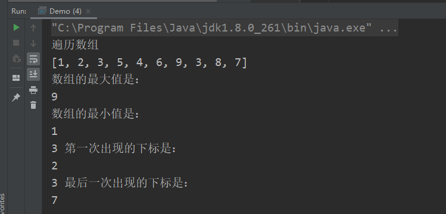
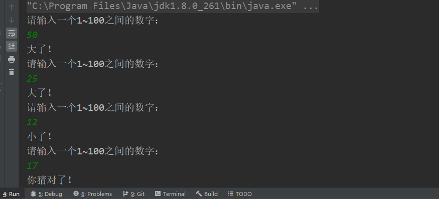

### 今日作业的目标

> 今日的作业巩固面向对象的基础语法，理解static关键字，代码块等语法

**完成作业后，需要将md文件转换成PDF格式，并命名为当天的课程名+下划线+自己的名字！压缩后提交！**

- 可以通过查看共享目录下，课程资料中**dayXx_Xxx**就是课程名
- 下划线不要弄错了，不能是空格或者横杠
- 下划线后跟自己的名字，不要在名字后面添一些乱七八糟的东西，如pdf后缀名
- 必须压缩后提交，压缩格式不限，rar、7z等等都可以
- 以上格式满足后，就可以提交作业了

```
提交作业的网址（局域网内网网站）：
	http://192.168.2.100:8080/upload/java/..th
链接最后的“..th”表示班级的期数，比如你是Java28期学生，这里就填入28th

一般来说，打开这个网站对浏览器种类没有特别的要求，仅建议不要直接使用微信自带浏览器
需要注意的是，如果多次重复提交某一天的作业，必须保持名字不同
	建议在“课程名+下划线+自己的名字”的后面加上2，3...之类的数字以示区分
```


## 操作题

> 操作题

- 练习Debug模式，给出程序执行必要的文字说明

```java 
public class Demo {
    public static void main(String[] args) {
        //注意不要同时放开两个new语句，避免互相影响
        //debug语句一，可以进入查看age的赋值过程
        /Person p = new Person(18);
        //debug语句二，进入查看nationality赋值过程
        //Person p2 = new Person("中国");
    }
}
class Person {
    int age = 10;
    static String nationality = "美国"; //类加载

    public Person(int age) {
        this.age = age;
    }


    public Person() {
    }

    public Person(String nationality) {
        Person.nationality = nationality; //创建对象
    }
}
```

我在上课的代码中，也有一些程序可以自行debug学习一下，有疑惑可以提出来~


## 非编程题

> 简答题直接给出答案即可~

### 简答题

> 以下简答题，请回答

1. 简述你理解的面向对象思想（自由发挥即可）

   ```
   面向对象的方法主要是把事物给对象化，包括其属性和行为。面向对象编程更贴近实际生活的思想。总体来说面向对象的底层还是面向过程，面向过程抽象成类，然后封装，方便使用就是面向对象（万物皆对象）。
   ```

2. 简述import关键字的使用

   - import + 全限定类名和static静态导入的区别

     ```
     前者可以导入整个类
     后者仅可导入类中的静态方法
     ```

3. 总结目前为止，普通成员变量和静态成员变量的赋值以及顺序

```
默认赋值 > 静态成员变量赋值 > 普通成员变量赋值 > 构造器赋值
```

## 编程题

编程题的答题要求：

```
编程题，需要先编写代码，执行调试完毕后
将代码以代码块（CTRL+A贴入整个Java文件内容，而不是一个main方法）的格式贴入md文件
并附上执行结果图片
```

**如何在Typora中插入代码块？**

1. 可以直接从idea复制代码，然后粘贴进md文档，Typora会自动转换成代码块的格式
2. 可以在md文档空白处中右键，然后插入代码块，再把代码复制进来（熟练了可以使用快捷键）
3. 代码块右下角可以选择语言，建议直接填入Java（这样做会有颜色标记关键字）

**如何在Typora中插入图片？**

1. 可以使用微信/QQ/windows/Snipaste截图等截图工具截图到计算机粘贴板，然后直接粘贴到md文档中
2. 可以在md文档空白处中右键，然后插入图像，自己选择本地图片的路径（可以用，但不推荐）

---


### 敲一遍老师上课的代码

> 根据老师在每一个Demo类注释的头部写的问题，逐一敲一遍老师的代码
>
> 尤其是那些不知道该怎么下手做作业的同学，一定要认真敲一遍老师代码

- 面向对象的语法如果不熟练，做作业之前先敲一遍，看起来容易做起来就会问题一堆


### 看程序答题

> 查看如下代码，回答问题，问题写在注释部分
>
> 该题目可以练习Debug的使用

```Java
/**
 * 问题1: 思考注释一能否放开?会不会报错?如果想要提升代码可读性,怎么做?
 	不会报错，；static定义的方法可以由类名称直接调用，为了提高可读性 可以使用类名.静态成员.方法的方式来调用 Homework.s.age
 
 * 问题2: 思考控制台输出的顺序,并用文字描述它,需要说明原因
        控制台输出结果是：
        Student building
        Student constructor
        main
        20
        Student building
        Student constructor
        Person building
        Person constructor
        刘备
     执行过程如下:
        * 当执行main方法时触发类加载
        * 执行static Student s = new Student();
        * 创建Student对象,调用Student对象的构造器,在调用构造器之前执行int age = 10;
        * 执行构造代码块 { } 里的内容 输出Student building 给age赋值20;
        * 执行构造器中的语句，输出Student constructor；此时类加载结束
        * 回到main方法中 输出main 由于s已被创建 s.age 被赋值20,输出20;
        * 执行Person p = new Person("刘备"); 调用person类中的构造器Person(name),
        * 触发该类类加载 执行static Student s = new Student();依次输出Student building和Student constructor;
        * 再按照顺序从上往下执行构造代码块中内容 name="赵云",并且输出Person building,
        * 再给name赋值为"曹操",最后执行到构造器,输出Person constructor 并且给name传参赋值为"刘备"
 * 问题3: Homework building和Homework constructor会不会输出,为什么?
   不会，因为没有创建Homework类的对象
 */
public class Homework {
    static Student s = new Student();
    {
        System.out.println("Homework building");
        s = null;
    }
    public static void main(String[] args) {
        System.out.println("main");
        //System.out.println(s.age); 注释一
        Person p = new Person("刘备");
        System.out.println(p.name);
    }

    public Homework() {
        System.out.println("Homework constructor");
    }
}
class Person{
    {
        name = "赵云";
        System.out.println("Person building");
    }
    String name = "曹操";
    static Student s = new Student();

    public Person() {
    }

    public Person(String name) {
        System.out.println("Person constructor");
        this.name = name;
    }
}

class Student{
    int age = 10;
    {
        System.out.println("Student building");
        age = 20;
    }

    public Student(int age) {
        this.age = age;
    }

    public Student(){
        System.out.println("Student constructor");
    }
}
```


### 导包问题

> 导包是很基本的操作，某些细节也需要注意

```Java
//在com.cskaoyan.a包下，定义一个名为MyClazz的类如下
     public class  MyClazz {
        public void hello() {
        System.out.println("a包");
       }
     }
     
//同时，在com.cskaoyan.b包下，一个类名也为MyClazz
     public class  MyClazz {
       public void hello() {
       System.out.println("b包");
       }
     }

//同时在com.cskaoyan.b包下定义一个Test类如下：
     public class Test {
       public static void main(String[] args) {
       MyClazz myClazz = new MyClazz();
       myClazz.hello();
       }
     }

/*
	毫无疑问，直接执行Test中的main方法会输出的是b包，思考以下问题（独立的三个问题）：
		1，不改变Test类中main方法的基础上，让main方法运行之后输出“a包”，应该怎么做？
		//在文件上方导入a包下的MyClazz
			package com.cskaoyan.b;
            import com.cskaoyan.a.MyClazz;
            public class Test {
                public static void main(String[] args) {
                    MyClazz myClazz = new MyClazz();
                    myClazz.hello();
                }
            }
		2，不做任何导包操作的基础上，修改main方法，让main方法运行之后同时输出“a包”和“b包”，应该怎么做？
		   package com.cskaoyan.b;
            public class Test {
                public static void main(String[] args) {
                    com.cskaoyan.a.MyClazz myClazz = new com.cskaoyan.a.MyClazz();
                    myClazz.hello();

                    MyClazz myClazz1 = new MyClazz();
                    myClazz1.hello();
                }
            }

		3，在Test类中添加导包语句import com.cskaoyan.a.*，
			不修改任何代码，执行main方法，输出的是什么？为什么？
			输出b包，因为智能导包如果同包下有同名类就不会再去导包了
*/

```


### 编写工具类

> 以下方法的实现，都是我们上课写过的代码，如果觉得自己很熟练了，直接抄代码即可
>
> 如果觉得不熟悉或者想再练习一遍，再写一遍也可以~
>
> 工具类：指的是其中方法全部是静态方法的类，工具类在使用时无需创建对象（静态方法无需对象调用）

```
写一个数组的工具类ArrayTool, 要求提供如下方法：
	遍历，求最大值，最小值，逆置数组元素
	查表(在数组中查找指定元素，若不存在，待查找元素返回-1，若存在返回元素在数组中首次出现的位置)
	查表（在数组中查找指定元素，若不存在，待查找元素返回-1，若存在返回元素在数组中最后一次出现的位置）
```

```java
package work3;

/**
 * @author zhchch
 * @date 2021/10/15 9:08
 */
public class Demo {
    public static void main(String[] args) {
        int[] arr = new int[]{1, 2, 3, 5, 4, 6, 9, 3, 8, 7};
        System.out.println("遍历数组");
        ArrayTool.traverse(arr);
        System.out.println("数组的最大值是：");
        System.out.println(ArrayTool.getArrayMaxValue(arr));
        System.out.println("数组的最小值是：");
        System.out.println(ArrayTool.getArrayMinValue(arr));

        System.out.println("3 第一次出现的下标是：");
        System.out.println(ArrayTool.retrieveFirst(arr, 3));

        System.out.println("3 最后一次出现的下标是：");
        System.out.println(ArrayTool.retrieveLast(arr, 3));
    }
}


class ArrayTool {
    //遍历数组
    //if数组是否长度为0 长度为0输出[]
    public static void traverse(int[] arr) {
        if (arr == null) {
            System.out.println("您输入的数据有误,请输入一个正确的数组!");
            return;
        }

        if (arr.length == 0) {
            System.out.println("[]");
            return;
        }
        System.out.print("[");
        for (int i = 0; i < arr.length; i++) {
            //最后一个元素不应该加逗号
            //if当前元素是否是最后一个元素
            if (i == arr.length - 1) {
                System.out.println(arr[i] + "]");
            } else {
                System.out.print(arr[i] + ", ");
            }
        }
    }


    //求数组中元素的最大值
    public static int getArrayMaxValue(int[] arr) {
        int max = arr[0];
        for (int i = 1; i < arr.length; i++) {
            if (arr[i] > max) {
                max = arr[i];
            }
        }
        return max;
    }

    //求数组中元素的最小值
    public static int getArrayMinValue(int[] arr) {
        int min = arr[0];
        for (int i = 1; i < arr.length; i++) {
            if (arr[i] < min) {
                min = arr[i];
            }
        }
        return min;
    }

    //逆置数组
    public static void reverse(int[] arr) {
        for (int start = 0, end = arr.length - 1; start <= end; start++, end--) {
            int temp;
            temp = arr[start];
            arr[start] = arr[end];
            arr[end] = temp;
        }
    }


    //查找某元素，输出它在数组中第一次出现的下标，输出-1表示该元素在数组中不存在
    public static int retrieveFirst(int[] arr, int targetValue) {
        int targetIndex = -1;
        for (int i = 0; i < arr.length; i++) {
            if (arr[i] == targetValue) {
                return i;
            }
        }
        return targetIndex;
    

    //查找某元素，输出它在数组中最后一次出现的下标，输出-1表示该元素在数组中不存在
    public static int retrieveLast(int[] arr, int targetValue) {
        int targetIndex = -1;
        for (int i = 0; i < arr.length; i++) {
            if (arr[i] == targetValue) {
                targetIndex = i;
            }
        }
        return targetIndex;
    }
}
```



### 猜数小游戏

> 百度和各种搜索就是生产力，尝试自己解决以下问题

```
先生成一个随机数（1~100的整数），再键盘输入猜测的数
如果猜的数大了或者小了，给出提示，继续猜，直到猜中为止
```

```java
package work04;

import java.util.Scanner;

/**
 * @author zhchch
 * @date 2021/10/15 9:26
 */
public class GuessDemo {
    public static void main(String[] args) {

        //Math.random()方法获取一个0~1的小数，左闭右开[0,1)
        //guessNum的范围是[1,100]
        int guessNum = (int) (Math.random() * 100) + 1;

        Scanner sc = new Scanner(System.in);
        boolean flag = true;
        while (flag) {
            System.out.println("请输入一个1~100之间的数字：");
            int num = Integer.parseInt(sc.next());
            if (num > guessNum) {
                System.out.println("大了！");
            } else if (num < guessNum) {
                System.out.println("小了！");
            } else {
                System.out.println("你猜对了！");
                flag = false;
            }
        }
    }
}
```



有多余时间的同学，预习面向对象第二阶段~


### 四、预习问题

> 预习的题目仅为预习提供思路，不用表现在作业中

预习面向对象第二阶段：访问权限、封装与继承，思考以下问题

- 访问权限有几种？各种访问权限修饰符分别能够作用在哪里？
- 什么是封装？为什么封装？
- 什么是继承？为什么继承？