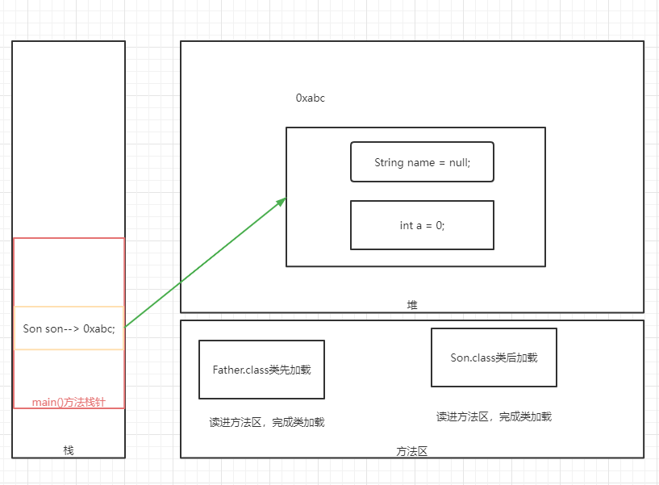
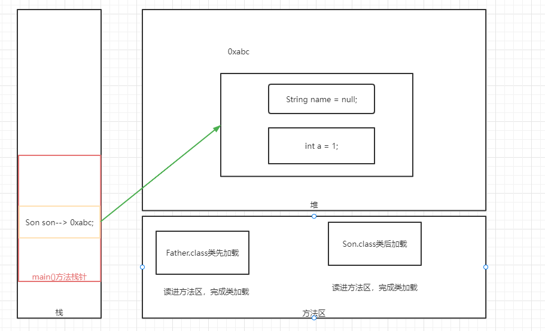
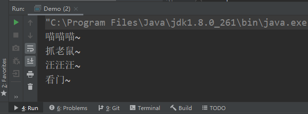
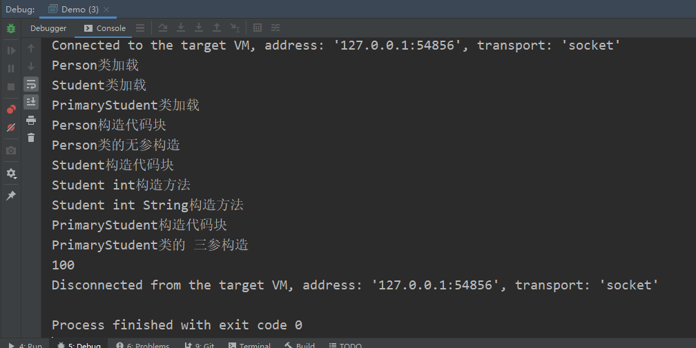

# 今日作业的目标

> 今日的作业以理解继承、子类对象初始化的过程为主，需要理解记忆相应的概念

**完成作业后，需要将md文件转换成PDF格式，并命名为当天的课程名+下划线+自己的名字！压缩后提交！**

- 可以通过查看共享目录下，课程资料中**dayXx_Xxx**就是课程名
- 下划线不要弄错了，不能是空格或者横杠
- 下划线后跟自己的名字，不要在名字后面添一些乱七八糟的东西，如pdf后缀名
- 必须压缩后提交，压缩格式不限，rar、7z等等都可以
- 以上格式满足后，就可以提交作业了

```
提交作业的网址（局域网内网网站）：
	http://192.168.2.100:8080/upload/java/..th
链接最后的“..th”表示班级的期数，比如你是Java28期学生，这里就填入28th

一般来说，打开这个网站对浏览器种类没有特别的要求，仅建议不要直接使用微信自带浏览器
需要注意的是，如果多次重复提交某一天的作业，必须保持名字不同
	建议在“课程名+下划线+自己的名字”的后面加上2，3...之类的数字以示区分
```


## 操作题

> 以下画图题，需要提交相应的图片，并附上必要的文字说明

- 使用WPS、Windows自带画图或者网页搜索ProcessOn画图，完成以下JVM内存模型图的练习
  - 对于Father、Son这种继承关系的两个类，创建Son对象，画图描述隐式子类对象初始化过程
  
    ```java
    Father{
    	int a;
        public Father(int a) {
            this.a = a;
        }
    }
    
    Son{
        String name;
    }
    ```
  
    
  
  - 对于Father、Son这种继承关系的两个类，创建Son对象，画图描述显式子类对象初始化过程
  
    

## 非编程题

> 以下简答题，请回答！

- 描述引用数据类型的自动类型转换和强制类型转换，并指出它们的特殊称呼

  ```
  1.引用数据类型想要发生类型转换的前提:
      引用数据类型的类型转换必须发生在具有父子关系的两个类之间
      如果是没有继承关系的两个类强制它类型转换，会编译报错
  2.引用数据类型的自动类型转换:
      a.条件:
      把子类的直接引用转换成父类的引用即可，这个过程不需要写额外代码，自动转换
      b.角度:
      从继承的角度来说，子类引用转成父类引用，在方向上是从下往上转的,所以引用数据类型的自动类型转换也称为"向上转型"
  3.引用数据类型的强制类型转换:
      a.条件:
      把父类的引用转换成子类的引用,这个过程需要写额外代码,强制转换相当于把父类对象当子类对象去使用，这在绝大多数情况下是不可能的
      所以引用数据类型的强制类型转换想要完成，需要父类的引用原来指向的就是子类的对象，可以使用instanceof判断能否转换成功
      b.强转的额外代码语法:
      子类引用 = (子类的类名)父类引用
      c.从继承的角度上来讲,父类引用转换成子类引用,在方向上是从上往下的，所以引用数据类型的强制类型转换也称之为"向下转型"
  ```

  

- 描述protected访问权限（分包描述）

  ```
  protected 在同包中的其他类,和不同包中子类均可见
  补充:
  不同包下的子类中,子类必须创建子类自身对象,通过自身对象才能访问从父类中继承过来的protected 成员
  其他情况都不行,包括创建父类对象,子类中创建别的子类对象.
  ```

  

## 编程题

编程题的答题要求：

```
编程题，需要先编写代码，执行调试完毕后
将代码以代码块（CTRL+A贴入整个Java文件内容，而不是一个main方法）的格式贴入md文件
并附上执行结果图片
```

**如何在Typora中插入代码块？**

1. 可以直接从idea复制代码，然后粘贴进md文档，Typora会自动转换成代码块的格式
2. 可以在md文档空白处中右键，然后插入代码块，再把代码复制进来（熟练了可以使用快捷键）
3. 代码块右下角可以选择语言，建议直接填入Java（这样做会有颜色标记关键字）

**如何在Typora中插入图片？**

1. 可以使用微信/QQ/windows/Snipaste截图等截图工具截图到计算机粘贴板，然后直接粘贴到md文档中
2. 可以在md文档空白处中右键，然后插入图像，自己选择本地图片的路径（可以用，但不推荐）

### 敲一遍老师上课的代码

> 根据老师在每一个Demo类注释的头部写的问题，逐一敲一遍老师的代码
>
> 尤其是那些不知道该怎么下手做作业的同学，一定要认真敲一遍老师代码

- 敲一敲子类对象初始化过程中隐式和显式的区别


### 继承的练习

> 明确记住，继承中的两个类应该有is-a关系

```
提供以下两个动物需要描述，请用你的知识来编写代码
猫：姓名，年龄，颜色，可以叫，可以抓老鼠
狗：姓名，年龄，性别，可以叫，可以看门

思考：人类研究出来了机器人，它们也有姓名，年龄，颜色等属性，可以套用本题中的继承体系吗？
 * 机器人类显然和动物没有is-a关系,不应该为了复用成员,强行使用继承
```

```java
package work01;

/**
 * @author zhchch
 * @date 2021/10/15 19:34
 */
public class Demo {
    public static void main(String[] args) {
        Animal animal0 = new Cat("花花", 2, "白色");
        Animal animal1 = new Dog("大黄", 3, "黄色");
        animal0.scream();
        ((Cat) animal0).skill();

        animal1.scream();
        ((Dog) animal1).skill();

    }
}

abstract class Animal {
    String name;
    int age;

    public Animal() {
    }

    public Animal(String name, int age) {
        this.name = name;
        this.age = age;
    }

    public abstract void scream();

    public String getName() {
        return name;
    }

    public void setName(String name) {
        this.name = name;
    }

    public int getAge() {
        return age;
    }

    public void setAge(int age) {
        this.age = age;
    }
}

class Cat extends Animal {
    String color;

    public Cat() {
    }

    public Cat(String name, int age, String color) {
        super(name, age);
        this.color = color;
    }

    @Override
    public void scream() {
        System.out.println("喵喵喵~");
    }

    public void skill() {
        System.out.println("抓老鼠~");
    }
}

class Dog extends Animal {
    String gender;

    public Dog() {
    }

    public Dog(String name, int age, String gender) {
        super(name, age);
        this.gender = gender;
    }

    @Override
    public void scream() {
        System.out.println("汪汪汪~");
    }

    public void skill() {
        System.out.println("看门~");
    }
}
```



### Debug练习

> 以下代码实际上是上课中代码，请Debug它，自己总结一下：
>
> 在创建子类对象时，如果存在继承关系，那么代码块，构造器，成员变量的赋值的顺序

```java 
public class Demo {
    public static void main(String[] args) {
        PrimaryStudent primaryStudent = new PrimaryStudent(666,888,"hello");
        System.out.println(primaryStudent.psVar);
    }
}
class Person {
    static {
        System.out.println("Person类加载");
    }
    {
        System.out.println("Person构造代码块");
    }
    public Person() {
        System.out.println("Person类的无参构造");
    }
}
class Student extends Person {
    static {
        System.out.println("Student类加载");
    }
    {
        System.out.println("Student构造代码块");
    }
    int sVar;
    String sVarString;
    public Student() {
        System.out.println("Student类无参构造");
    }
    public Student(int sVar) {
        System.out.println("Student int构造方法");
        this.sVar = sVar;
    }
    public Student(int sVar, String sVarString) {
        this(sVar);
        System.out.println("Student int String构造方法");
        this.sVarString = sVarString;
    }
}
class PrimaryStudent extends Student {
    static {
        System.out.println("PrimaryStudent类加载");
    }
    {
        System.out.println("PrimaryStudent构造代码块");
    }
    int psVar = 10;
    public PrimaryStudent(int psVar, int sVar, String sVarString) {
        super(sVar, sVarString);
        System.out.println("PrimaryStudent类的 三参构造");
        this.psVar = psVar = 100;
    }
}
```



```
当执行main方法时会触发demo类的类加载，但是demo类中并没有静态成员，因此直接进入到main方法当中，首先创建primaryStudent对象，此时会触发primaryStudent类的类加载，但是primaryStudent继承自Student类，所以会先触发Student类的类加载，同时Student类继承自Person类，同理会先触发Person类的类加载，因此第一条输出语句就是Person类中的静态代码块中的输出语句，同理按顺序输出Student类和PrimaryStudent类中的静态代码块中的输出语句，接着会回到PrimaryStudent类中的三参构造方法，由于第一行调用了超类的构造函数，因此会跳转到Student类中的双参构造方法，双参构造方法又调用了单参构造方法，而单参构造方法中隐式调用了超类的空参构造方法，所以会从Person类中的代码块开始执行，再执行构造函数中的语句，同理Student类和PrimaryStudent类也会先执行构造代码块中的语句再执行构造函数中的语句，最终得到输出结果入图所示
```


### 工具类禁止创建对象

> 普遍来说，工具类不应该创建对象，应该私有化构造方法

```
需求一：在昨天自己的作业，数组工具类的基础上，私有化它的构造方法
需求二：
定义一个Scanner工具类ScannerUtils，提供以下方法：
	1，键盘录入字符串
	2，键盘录入int整数
	3，键盘录入一个Person对象（Person类中有age和name属性）
```

```java
class ArrayTool {
    //构造器私有化
    private ArrayTool() {
    } 
}
```

```java
package work03;

public class Person {
    private String name;
    private int age;

    public String getName() {
        return name;
    }

    public void setName(String name) {
        this.name = name;
    }

    public int getAge() {
        return age;
    }

    public void setAge(int age) {
        this.age = age;
    }

    public Person() {
    }

    public Person(String name, int age) {
        this.name = name;
        this.age = age;
    }

    public void print() {
        System.out.println("该Person的名字为：" + this.name + "   年龄为：" + this.age);
    }
}
```

```java
package work03;

import java.util.Scanner;

public class ScannerTools {
    private static Scanner sc = new Scanner(System.in);

    //工具类无需在外部创建对象，应该私有化它
    private ScannerTools() {
    }

    public static String getStringByScanner() {
        System.out.println("请输入字符串：");
        return sc.nextLine();
    }

    public static int getIntByScanner() {
        System.out.println("请输入一个int整数：");
        return Integer.parseInt(sc.nextLine());
    }

    //工具类接收对象，先接收各个成员变量的取值，最后使用构造方法创建对象即可
    public static Person getPersonInstanceByScanner() {
        System.out.println("现在开始键盘录入一个Person对象！");
        System.out.println("请输入Person对象的名字：");
        String name = sc.nextLine();
        System.out.println("请输入Person对象的年龄：");
        int age = Integer.parseInt(sc.nextLine());
        Person p = new Person(name, age);
        System.out.println("Person对象创建完毕！");
        return p;
    }

    //录入数组，录入对象和上述方法是一样的，所以直接调用即可
    public static Person[] getPersonArrByScanner(int length) {
        Person[] targetArr = new Person[length];
        System.out.println("现在开始为Person数组输入Person对象！");
        System.out.println("你总共需要输入" + length + "个Person对象！");
        for (int i = 0; i < targetArr.length; i++) {
            System.out.println("现在是输入第" + (i + 1) + "个Person对象！");
            targetArr[i] = getPersonInstanceByScanner();
        }
        System.out.println("Person数组输入完毕！");
        return targetArr;
    }

    public static void closeScanner() {
        sc.close();
    }
}
```

```java
package work03;

public class Test {
    public static void main(String[] args) {
        Person p = ScannerTools.getPersonInstanceByScanner();
        p.print();
        System.out.println("-----------------------");
        Person[] personArrByScanner = ScannerTools.getPersonArrByScanner(5);
        for (Person person : personArrByScanner) {
            person.print();
        }
    }
}
```

```
运行结果：
现在开始键盘录入一个Person对象！
请输入Person对象的名字：
李四
请输入Person对象的年龄：
43
Person对象创建完毕！
该Person的名字为：李四   年龄为：43
-------------------------------------
现在开始为Person数组输入Person对象！
你总共需要输入3个Person对象！
现在是输入第1个Person对象！
现在开始键盘录入一个Person对象！
请输入Person对象的名字：
王五
请输入Person对象的年龄：
34
Person对象创建完毕！
现在是输入第2个Person对象！
现在开始键盘录入一个Person对象！
请输入Person对象的名字：
张三
请输入Person对象的年龄：
22
Person对象创建完毕！
现在是输入第3个Person对象！
现在开始键盘录入一个Person对象！
请输入Person对象的名字：
赵六
请输入Person对象的年龄：
33
Person对象创建完毕！
Person数组输入完毕！
该Person的名字为：王五   年龄为：34
该Person的名字为：张三   年龄为：22
该Person的名字为：赵六   年龄为：33

Process finished with exit code 0
```


### getter/setter方法

> 当属性私有化，又有外界访问需求时，提供getter、setter方法

```
创建两个类，分别用来表示长方形和正方形。
同时定义所需的成员变量，代表长方形或者正方形的边长（私有化成员变量）
   在两个类中分别定义两个成员方法，求对应图形的面积和周长。
   并提供相应的getter，setter方法，获取以及改变长方形和正方形的边长。
最后，写代码测试一下
```

```java
package work04;

/**
 * @author zhchch
 * @date 2021/10/15 20:46
 */
public class ExerciseGetter {
    public static void main(String[] args) {
        Rectangle r = new Rectangle(3, 4);  //定义一个长方形
        System.out.println(r.getArea());
        System.out.println(r.getCircumference());

        Square s = new Square(5);     //定义一个正方形
        System.out.println(s.getArea());
        System.out.println(s.getCircumference());
    }
}

//长方形类
class Rectangle {
    private double length; //长
    private double width; //宽

    //构造方法
    public Rectangle() {
    }

    public Rectangle(double length, double width) {
        this.length = length;
        this.width = width;
    }

    //Getter、Setter方法
    public double getLength() {
        return length;
    }

    public void setLength(double length) {
        this.length = length;
    }

    public double getWidth() {
        return width;
    }

    public void setWidth(double width) {
        this.width = width;
    }

    //获取面积
    public double getArea() {
        return this.length * this.width;
    }

    //获取周长
    public double getCircumference() {
        return 2 * (this.length + this.width);
    }
}

//正方形类
class Square {
    private double length;  //边长

    public Square() {
    }

    public Square(double length) {
        this.length = length;
    }

    //Getter、Setter方法
    public double getLength() {
        return length;
    }

    public void setLength(double length) {
        this.length = length;
    }

    //获取面积
    public double getArea() {
        return this.length * this.length;
    }

    //获取周长
    public double getCircumference() {
        return 4 * this.length;
    }

}
```


### 禁止创建对象

> 综合封装性，static等知识点
>
> 最后再做这道题吧~实际上课堂上已经说过这道题了

```
定义一个Student类，并要求在其他类中，最多只能创建10个Student类的对象。
	分析：
		1，如果允许外部直接创建对象，显然无法控制创建对象的个数
		2，需要计数器指示外部创建对象的个数
```

```java
package work05;

/**
 * @author zhchch
 * @date 2021/10/15 20:55
 */
public class Demo {
    public static void main(String[] args) {
        for (int i = 0; i < 12; i++) {
            System.out.println("创建的对象是：" + Student.getInstance());
        }
    }
}

class Student {
    private static int count = 1;
    private String name;
    private int age;

    private Student() {
    }

    private Student(String name, int age) {
        this.name = name;
        this.age = age;
    }


    public static Student getInstance() {
        if (count <= 10) {
            System.out.println("创建Student对象" + Student.count + "次");
            Student.count++;
            return new Student();
        } else {
            System.out.println("创建失败");
            return null;
        }
    }


    public static int getCount() {
        return count;
    }

    public static void setCount(int count) {
        Student.count = count;
    }

    public String getName() {
        return name;
    }

    public void setName(String name) {
        this.name = name;
    }

    public int getAge() {
        return age;
    }

    public void setAge(int age) {
        this.age = age;
    }
}
```

```
运行结果是：
创建Student对象1次
创建的对象是：work05.Student@1b6d3586
创建Student对象2次
创建的对象是：work05.Student@4554617c
创建Student对象3次
创建的对象是：work05.Student@74a14482
创建Student对象4次
创建的对象是：work05.Student@1540e19d
创建Student对象5次
创建的对象是：work05.Student@677327b6
创建Student对象6次
创建的对象是：work05.Student@14ae5a5
创建Student对象7次
创建的对象是：work05.Student@7f31245a
创建Student对象8次
创建的对象是：work05.Student@6d6f6e28
创建Student对象9次
创建的对象是：work05.Student@135fbaa4
创建Student对象10次
创建的对象是：work05.Student@45ee12a7
创建失败
创建的对象是：null
创建失败
创建的对象是：null

Process finished with exit code 0
```


### 四、预习问题

> 预习的题目仅为预习提供思路，不用表现在作业中

- 预习继承的其它知识点、final和多态，重点思考以下问题
  - final关键字如何使用？
  - 多态是什么？发生多态的条件是什么？

