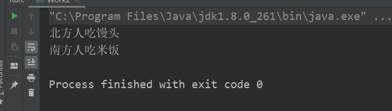
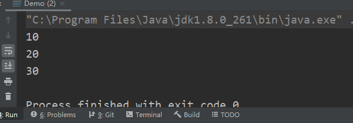

# 今日作业的目标

> 今日的需要自己总结、复习一下前面的知识，理解多态，学习使用接口和抽象类

**完成作业后，需要将md文件转换成PDF格式，并命名为当天的课程名+下划线+自己的名字！压缩后提交！**

- 可以通过查看共享目录下，课程资料中**dayXx_Xxx**就是课程名
- 下划线不要弄错了，不能是空格或者横杠
- 下划线后跟自己的名字，不要在名字后面添一些乱七八糟的东西，如pdf后缀名
- 必须压缩后提交，压缩格式不限，rar、7z等等都可以
- 以上格式满足后，就可以提交作业了

```
提交作业的网址（局域网内网网站）：
	http://192.168.2.100:8080/upload/java/..th
链接最后的“..th”表示班级的期数，比如你是Java28期学生，这里就填入28th

一般来说，打开这个网站对浏览器种类没有特别的要求，仅建议不要直接使用微信自带浏览器
需要注意的是，如果多次重复提交某一天的作业，必须保持名字不同
	建议在“课程名+下划线+自己的名字”的后面加上2，3...之类的数字以示区分
```


## 操作题

> 操作题，无需表现在作业答案中，自己琢磨和练习即可

待补充！

## 编程题

> 以下简答题，请回答

- 简答1：多态的条件
  
  - 结合多态发生的条件，及继承的相关知识，自己总结并验证下，哪些情况下是无法发生多态的
  
    ```
    多态发生的条件:
     *      1.必须存在继承,多态一定发生在父子类之间
     *      2.必须存在方法重写,不同的子类需要重写父类中的同名方法
     *      3.必须存在父类引用指向子类对象
     
    不能发生多态的场景:
     *      1.不能继承的类,final修饰的类
     *      2.不能重写的方法,final修饰的方法,static方法,private方法,构造方法
     *      3.必须写代码用父类引用指向子类对象
    ```
  
    
  
- 简答2：测试一下访问类的全局常量是否触发类加载
  
  - 测试基本数据类型和引用数据类型
  
    ```
     访问类的基本数据类型全局常量不会触发该类完整类加载
     * 访问引用数据类型全局常量,如果是new对象方式创建的对象,会触发完整类加载
     *      如果是String,使用字面值常量赋值的方式,也不会触发完整的类加载
    ```
  
    ```java
    public class Demo2 {
        public static void main(String[] args) {
            System.out.println(A.VAR);
        }
    }
    class A{
        static final  String VAR ="hello world!";
        static {
            System.out.println("A类的静态代码块执行了");
        }
    }
    ```
  
    
  
    ```java
    public class Demo2 {
        public static void main(String[] args) {
            System.out.println(A.VAR);
        }
    }
    class A{
        static final  Demo VAR = new Demo();
        static {
            System.out.println("A类的静态代码块执行了");
        }
    }
    ```
  
    
  
  ```java
  public class Demo2 {
      public static void main(String[] args) {
          System.out.println(A.VAR);
      }
  }
  class A{
      static final  char  VAR = 'a';
      static {
          System.out.println("A类的静态代码块执行了");
      }
  }
  ```
  
  
  
- 简答3：测试一下方法重写当中，方法的返回值类型必须兼容
  
  - 是否必须要保持一致，所谓兼容是什么意思？
  
    ```
    不用必须要保持完全一致，但是返回类型必须和被重写方法的返回类型相同或者是返回类型的子类型
    ```
  
- 简答4：测试一下方法的返回值类型如果是一个类名时
  - 可以返回什么对象？
  
    ```
    该类或者该类的子类的实例对象
    ```
  
  - 如果返回值类型是一个抽象类呢？
  
    ```
    该抽象类的子类对象
    ```
  
  - 如果是一个接口做返回值呢？
  
    ```
    实现了该接口的对象
    ```

## 编程题

编程题的答题要求：

```
编程题，需要先编写代码，执行调试完毕后
将代码以代码块（CTRL+A贴入整个Java文件内容，而不是一个main方法）的格式贴入md文件
并附上执行结果图片
```

**如何在Typora中插入代码块？**

1. 可以直接从idea复制代码，然后粘贴进md文档，Typora会自动转换成代码块的格式
2. 可以在md文档空白处中右键，然后插入代码块，再把代码复制进来（熟练了可以使用快捷键）
3. 代码块右下角可以选择语言，建议直接填入Java（这样做会有颜色标记关键字）

**如何在Typora中插入图片？**

1. 可以使用微信/QQ/windows/Snipaste截图等截图工具截图到计算机粘贴板，然后直接粘贴到md文档中
2. 可以在md文档空白处中右键，然后插入图像，自己选择本地图片的路径（可以用，但不推荐）

### 一遍老师上课的代码

> 根据老师在每一个Demo类注释的头部写的问题，逐一敲一遍老师的代码
>
> 尤其是那些不知道该怎么下手做作业的同学，一定要认真敲一遍老师代码

- 手写测试一下接口和抽象类的成员（有哪些）

```java
抽象类的成员的特点：
抽象类实际上和普通类能够定义的成员是一样的,普通类中有的东西它都有,只不过多了一个抽象方法


接口的成员特点:
 *      1.成员变量
 *          在接口中,是可以定义成员变量的,但是接口中的成员变量默认是public static final修饰的公共的全局常量
 *      2.抽象方法/成员方法:
 *          接口中可以定义抽象方法,实际上接口中的方法在Java8之前只能是抽象方法,默认使用public abstract修饰,这两个关键字可以不用写出来
 *          Java8中接口的语法迎来了大的变动,新增了两种具有方法体的实现方法:
 *              1.默认方法
 *                  默认方法的语法:
 *                  default 返回值类型 方法名(形参列表){
 *                      //方法体
 *                  }
 *              2.静态方法
 *                  静态方法:
 *                  static 返回值类型 方法名(形参列表){
 *                      //方法体
 *                  }
 *      4.构造方法
 *          接口没有构造方法
 *
 *      5.代码块
 *          没有静态代码块,也没有构造代码块
```


### final练习

> final修饰成员变量成为一个常量，必须显式赋值

```
自定义一个类，类中定义三个成员变量a，b，c，用final修饰这三个成员变量
再定义两个静态成员变量staticA和staticB，也用final修饰这两个静态成员变量
然后：
	1，请用三种不同的方式，分别为a，b，c赋值
	2，请用两种不同的方式，分别为staticA和staticB赋值
```

```java
package _final;

/**
 * @author zhchch
 * @date 2021/10/14 21:31
 */
public class Demo {
    //显式赋值
//    final int a = 10;
//    final int b = 11;
//    final int c = 12;

    //构造代码块赋值
//    final int a ;
//    final int b ;
//    final int c;
//    {
//        a = 10;
//        b = 11;
//        c = 12;
//    }

    //构造方法赋值
    final int a;
    final int b;
    final int c;

    public Demo(int a, int b, int c) {
        this.a = a;
        this.b = b;
        this.c = c;
    }


    //显式赋值
    final static int staticA = 10;
    final static int staticB = 11;


    //静态代码块赋值
//    final static int staticA;
//    final static int staticB;
//    static {
//        staticA = 10;
//        staticB = 11;
//    }

}
```


### 多态练习

> 牢记多态发生的条件

```
请根据题目，作出合理设计，定义如下类：
Person
	属性：String name，int age
	行为：eat();
	
SouthPerson
	属性：String name，int age，double salary
	行为：eat()，swim()

NorthPerson
	属性：String name，int age，double height
	行为：eat()，drink()

写代码实现，eat()方法的多态效果
	1，人都要吃饭
	2，南方人喜欢吃米饭
	3，北方人喜欢吃面食

最后，在测试类中，编写测试代码，要求进行如下测试：
	1，编写测试方法，
		要求该方法允许传入SouthPerson对象和NorthPerson对象，并在方法体中调用它们的eat()方法
	2，用父类引用指向子类对象的方式创建SouthPerson对象，能否直接访问salary属性和swim()方法？
		如果不能，应该怎么写代码让它能够正常调用？
	3，用父类引用指向子类对象的方式创建NorthPerson对象，能否（直接或写代码）访问salary属性和swim()方法？
		如果不能，将该对象引用强转为SouthPerson引用，能否成功？为什么？
```

```java
package _polymorphic;

/**
 * @author zhchch
 * @date 2021/10/14 21:41
 */
public class Demo {
    public static void main(String[] args) {
        NorthPerson northPerson = new NorthPerson();
        SouthPerson southPerson = new SouthPerson();
        test(northPerson);
        test(northPerson);
        Person person = new SouthPerson();
        SouthPerson southPerson1 = (SouthPerson) person;
        System.out.println(southPerson1.salary);
        southPerson1.swim();
        Person person1 = new NorthPerson();
    }

    public static void test(Person p) {
        p.eat();
    }
}

abstract class Person {
    public String name;
    public int age;

    public void eat() {
        System.out.println("人都要吃饭");
    }
}

class SouthPerson extends Person {
    public double salary;

    @Override
    public void eat() {
        System.out.println("南方人喜欢吃米饭");
    }

    public void swim() {
        System.out.println("南方人喜欢游泳");
    }
}

class NorthPerson extends Person {
    double height;

    @Override
    public void eat() {
        System.out.println("北方人喜欢吃面食");
    }

    public void drink() {
        System.out.println("南方人喜欢喝酒");
    }
}
```



```
2. 不能直接访问salary属性和swim方法，需要向下转型后，方可正常调用
```

```
3.  不能访问salary属性和swim方法，不能将该对象引用强转为SouthPerson引用，因为该对象的运行时类型是NorthPerson
```


### 抽象类练习

> 抽象类的基本使用

```
定义抽象类A，抽象类B继承A，普通类C继承B。
A类中，定义成员变量a赋值为10，抽象showA方法
B类中，定义成员变量b赋值为20，抽象showB方法
C类中，定义成员变量c赋值为30，重写showA方法打印a，重写showB方法打印b，定义showC方法，打印c
测试类中，创建C对象，调用showA方法，showB方法，showC方法
```

```java
package work3;

/**
 * @author zhchch
 * @date 2021/10/14 22:40
 */
public class Demo {
    public static void main(String[] args) {
        C c = new C();
        c.showA();
        c.showB();
        c.showC();
    }
}

abstract class A {
    int a = 10;

    public abstract void showA();
}

abstract class B extends A {
    int b = 20;

    public abstract void showB();
}

class C extends B {
    int c = 30;

    @Override
    public void showA() {
        System.out.println(a);
    }

    @Override
    public void showB() {
        System.out.println(b);
    }

    public void showC() {
        System.out.println(c);
    }

}
```



### 接口与抽象类

> 完成以下练习

```
学生和老师都有共同的属性: name、gender、age
共同的行为：eat() sleep()
老师和学生都需要（额外地）学习知识（这里定义一个接口）
请定义抽象类和接口，描述以上体系

然后进行测试：
测试以下方式:
	1，用不同的父类指向不同的子类对象，理解“编译看左边”
	2，用这些引用调用方法，理解“运行时看右边”
```

```java
package work4;

/**
 * @author zhchch
 * @date 2021/10/14 22:48
 */
public class Demo {
    public static void main(String[] args) {
        Person teacher = new Teacher();
        teacher.eat();
        teacher.sleep();
        teacher.learningEnglish();
        Person student = new Student();
        student.eat();
        student.sleep();
        student.learningEnglish();

        System.out.println("===================");
        IStudy iStudy1 = new Teacher();
        iStudy1.learningEnglish();
        iStudy1.test();
        IStudy iStudy2 = new Student();
        iStudy2.learningEnglish();
        iStudy2.test();
    }
}

interface IStudy {
    void learningEnglish();

    default void test() {
        System.out.println("defalut方法");
    }
}


abstract class Person implements IStudy {
    String name;
    String gender;
    int age;

    public abstract void eat();

    public abstract void sleep();
}

class Teacher extends Person {
    @Override
    public void eat() {
        System.out.println("老师需要吃饭");
    }

    @Override
    public void sleep() {
        System.out.println("老师需要睡觉");
    }

    @Override
    public void learningEnglish() {
        System.out.println("老师学英语");
    }
}

class Student extends Person {
    @Override
    public void eat() {
        System.out.println("学生需要吃饭");
    }

    @Override
    public void sleep() {
        System.out.println("学生需要睡觉");
    }


    @Override
    public void learningEnglish() {
        System.out.println("学生学英语");
    }
}
```


## 预习问题

> 预习的题目仅为预习提供思路，不用表现在作业中

- 预习接口和内部类，思考如下问题（**内部类必须要预习**）
  - 什么是接口？怎么定义接口？接口有什么作用？
  - 什么是内部类？内部类的分类是什么？
  - 内部类有什么特点？